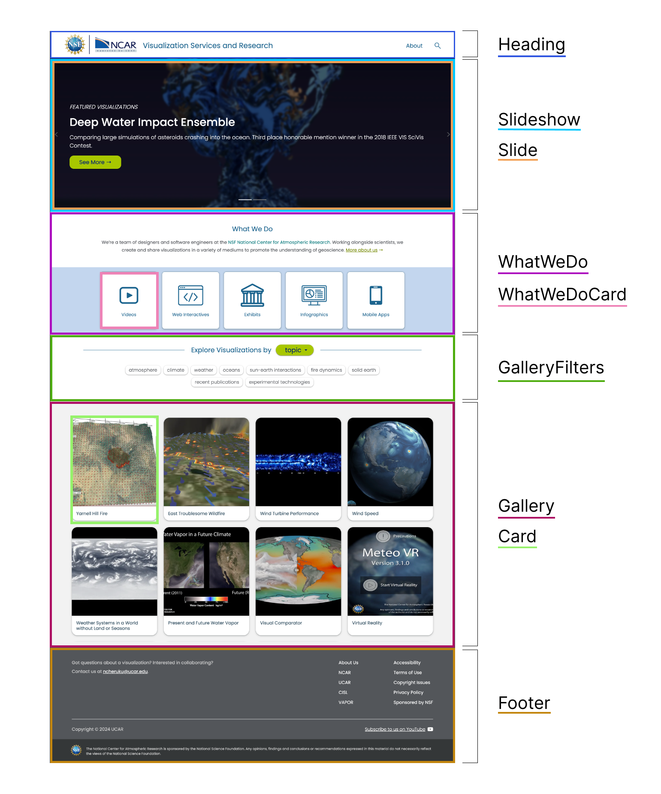
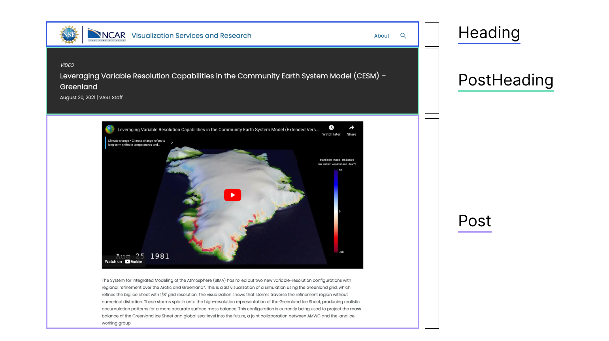

# ViSR Visualization Gallery

A refresh of ViSR's Visualization Gallery, showcasing data visualizations on different topics in geoscience in a variety of mediums and in collaboration with scientists.

# Table of Contents
- [Project Structure](#project-structure)
- [Guide to Site Layout and Components](#guide-to-site-layout-and-components)
- [Contributor Guide](#contributor-guide)
  - [Adding a Post](#adding-a-post)
  - [Markdown Content Options](#markdown-content-options)
  - [Advanced Editing](#advanced-editing)

# Project Structure

This site is built with [Astro](https://astro.build/), a content-driven web framework that can be used for static site generation. See documentation [here](https://docs.astro.build).  

```text
/
├── public/                           # Holds static assets such as logos.
│
├── src/                              # Astro processes, optimizes, and bundles these src/ files to create the final website shipped to the browser.
│   │
│   ├── assets/                       # Holds most of the site's images and other assets. Astro automatically optimizes image loading from this folder by configuring size and resolution at build time.
│   │
│   ├── components/                   # Holds site components. Each file is a reusable unit of HTML, CSS, and JavaScript for a piece of the website interface.
│   │
│   ├── content/                      # Reserved project directory for content collections. Also holds config file that defines the schema for each collection.
│   │   │
│   │   └── visualizations/           # Content collection for visualization posts. Each markdown page in this folder is automatically rendered in the frontend and exposed as a route based on its file name.
│   │
│   ├── templates/                    # Holds markdown file templates.
│   │
│   ├── pages/                        # Reserved project directory for site pages. Holds one Astro file for each page of the website (index, about, and [...slug] for each visualization page.)
│   │
│   └── styles/                       # Holds global css stylesheet.
│
├── astro.config.mjs                  # Generated in every starter template and includes configuration options for the Astro project (specify integrations to use, build options, server options, and more).
│
├── package-lock.json                 # Keeps track of exact dependency trees at any given time.
│
└── package.json                      # A file used by JavaScript package managers to manage dependencies. It also defines the scripts that are commonly used to run Astro (ex: npm start, npm run build)
```

## Commands

All commands are run from the root of the project, from a terminal:

| Command                   | Action                                           |
| :------------------------ | :----------------------------------------------- |
| `npm install`             | Installs dependencies                            |
| `npm run dev`             | Starts local dev server at `localhost:4321`      |
| `npm run build`           | Build your production site to `./dist/`          |
| `npm run preview`         | Preview your build locally, before deploying     |
| `npm run astro ...`       | Run CLI commands like `astro add`, `astro check` |
| `npm run astro -- --help` | Get help using the Astro CLI                     |

# Guide to Site Layout and Components

Most of the website code is located in `src/components`. Each `.astro` file in this folder contains the HTML, CSS, and JavaScript for a component of a website (aka a piece of the interface). 




# Contributor Guide

## Adding a Post

## Markdown Content Options

## Advanced Editing
