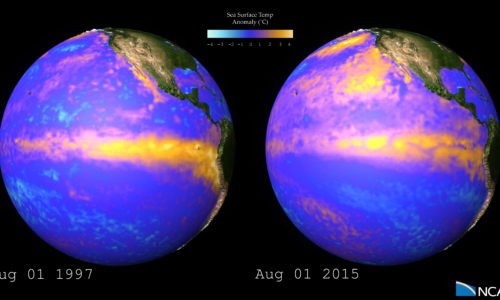

---
# Copy this file for a template that can then be placed in src/content/visualizations.
# String: full title of post.
title: "1997 and 2015 El Niño Sea Surface Temperature Anomalies"

# String (optional): shortened version of title for display on home page in card.
shortenedTitle: "El Niño Comparison"

# String (optional, by default "VAST Staff"). Author of this post.
author: "VAST Staff"

# String in the form "December 10, 2019".
datePosted: "August 29, 2018" 

# String representing a valid URL to an image. Used in the card on the main page.
coverImage: "/src/assets/1997-and-2015-el-nino-sea-surface-temperature-anomalies.jpg"

# Array of strings. Each string (case insensitive) represents a filter from the front page. Tags that do not correspond to a current filter will be ignored for filtering.
topicTags: ["oceans"]
modelTags: [""]
softwareTags: ["NCAR command language"]

# String describing the main media type ("Video", "Image", "App", etc). Is displayed in the post heading as a small tag.
mediaType: "Video"

# The following headings and subheadings are provided examples - unused ones can be deleted.
---

<iframe width="560" height="315" src="https://www.youtube.com/embed/whsQbIwWjBo?si=Op4PfdLu5H9ny7Zi" title="YouTube video player" frameborder="0" allow="accelerometer; autoplay; clipboard-write; encrypted-media; gyroscope; picture-in-picture; web-share" referrerpolicy="strict-origin-when-cross-origin" allowfullscreen></iframe>

A brief comparison of changes in sea surface temperature (SST) anomalies between the major El Niño event of 1997-98 and the El Niño event emerging in 2015. The visualization depicts data from the NOAA 1/4° daily Optimum Interpolation Sea Surface Temperature (OISST). The data are combined from sources such as satellites, buoy networks, and ships. The OISST analyses are named for the key satellite sensor used: in this case, the Advanced Very High Resolution Radiometer (AVHRR). More about OISST/AVHRR: [https://www.ncdc.noaa.gov/oisst](https://www.ncdc.noaa.gov/oisst).

____

#### More Media

____

#### About the Science

##### Data Source

NOAA – National Oceanic and Atmospheric Administration www.noaa.gov

Earth imagery is courtesy of the NASA Visible Earth Project
___

#### About the Visualization

##### Visualization and Post-production

Matt Rehme (NCAR/CISL)

Special Thanks to Tim Scheitlin (NCAR/CISL)

##### Visualization Software

The NCAR Command Language (Version 6.3.0) [Software]. (2015). Boulder, Colorado: UCAR/NCAR/CISL/VETS. http://dx.doi.org/10.5065/D6WD3XH5