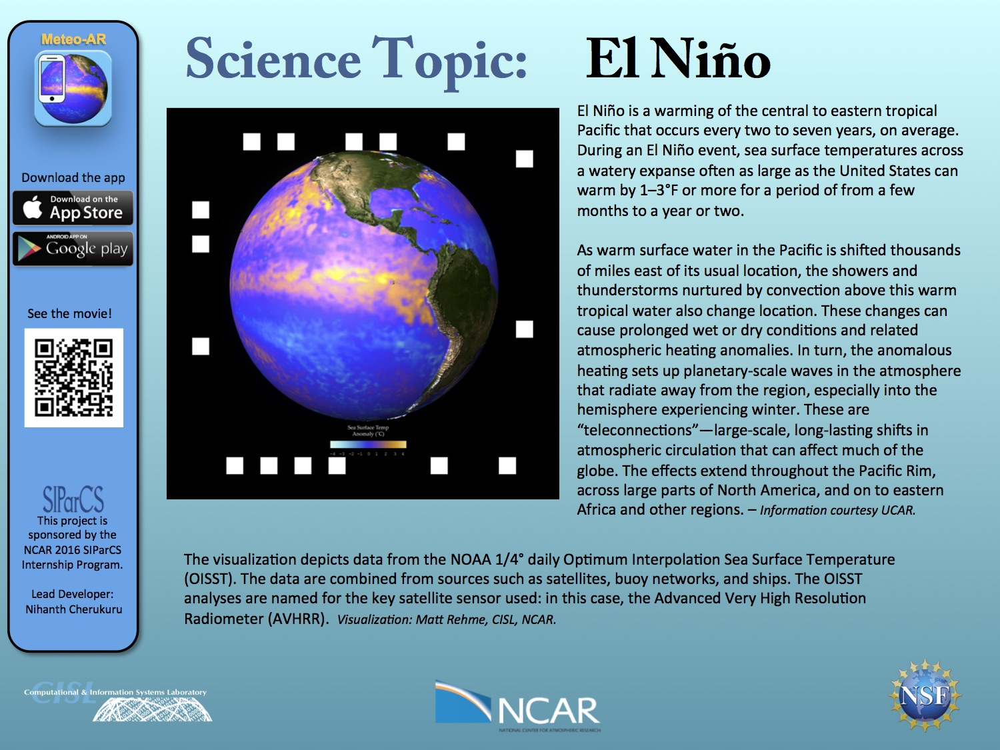
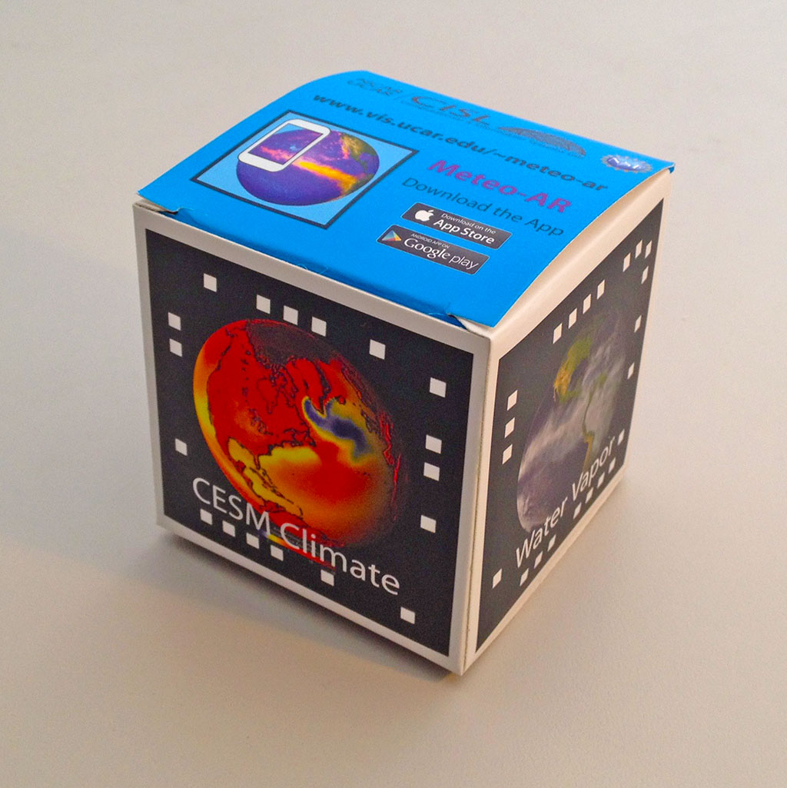
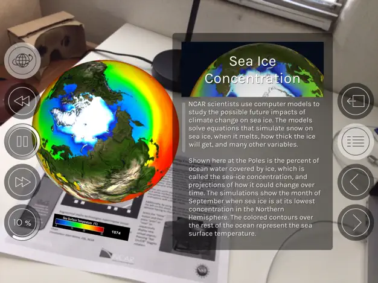
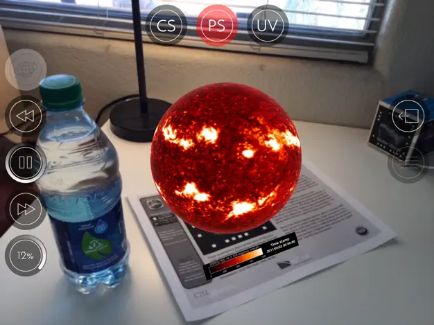

---
# Copy this file for a template that can then be placed in src/content/visualizations. The name of this file will be used as the URL for the post.

# String: full title of post.
title: "Augmented Reality"

# String (optional): shortened version of title for display on home page in card.
shortenedTitle: ""

# String (optional, by default "VAST Staff"). Author of this post.
author: ""

# String in the form "December 10, 2019".
datePosted: "January 4, 2019" 

# String representing a valid path to an image. Used in the card on the main page. Likely to be in the form "/src/assets/..." for images located in src/assets.
coverImage: "/src/assets/augmented-reality-1.png"

# The three following tag arrays are each an array of strings. Each string (case insensitive) represents a filter from the front page. Tags that do not correspond to a current filter will be ignored for filtering.

# options: atmosphere, climate, weather, oceans, sun-earth interactions, fire dynamics, solid earth, recent publications, experimental technologies
topicTags: ["experimental technologies"]

# options: CAM, CESM, CM1, CMAQ, CT-ROMS, DIABLO Large Eddy Simulation, HRRR, HWRF, MPAS, SIMA, WACCM, WRF
modelTags: [""]

# options: Blender, Maya, NCAR Command Language, ParaView, Visual Comparator, VAPOR
softwareTags: [""]

# Case insensitive string describing the main media type ("Video", "Image", "App", etc). This is displayed in the post heading as a small tag above the title.
mediaType: "App"

# The following headings and subheadings are provided examples - unused ones can be deleted. All Markdown content below will be rendered in the frontend.
---

 

NSF NCAR has implemented Augmented and [Virtual Reality](/visualizations/virtual-reality) (AR/VR) technologies to help make NCAR science more engaging and accessible to a wider audience. We have developed mobile apps and tools that enable users to explore geoscience data from their mobile device, such as an iPhone, iPad, or an Android device.   The apps are free and available for download at the Apple Store and for Android devices at Google Play.

#### Meteo AR

<iframe width="560" height="315" src="https://www.youtube.com/embed/FZf04v3rbbU?si=RCOM1rude84jic_S" title="YouTube video player" frameborder="0" allow="accelerometer; autoplay; clipboard-write; encrypted-media; gyroscope; picture-in-picture; web-share" referrerpolicy="strict-origin-when-cross-origin" allowfullscreen></iframe>

Meteo AR is an **Augmented Reality** (AR) application that displays interactive virtual objects, like an animated globe or a hurricane, over real world imagery that is captured by your mobile device’s camera.  The app works with the NCAR “science cube” or the downloadable “[science sheets](https://s3-us-west-1.amazonaws.com/meteoappsv3bucket/DoNotRemove_Files4MeteoAR/Meteo_AR_markersheet.pdf)“. The science sheets also include background information about the science topics like El Niño, Hurricanes, and Climate Change to help you understand and interpret what you are seeing.

___

#### More Information and How to Download

<a class="launch-button" href="http://meteoappsweb.s3-website-us-west-1.amazonaws.com/" alt="More information about Meteo AR and VR">Click here</a>

___

#### More Media

##### Augmented Reality 

##### Science Sheets

##### Science Cube

##### Using Meteo AR

##### Using Meteo AR

##### Using Meteo AR

