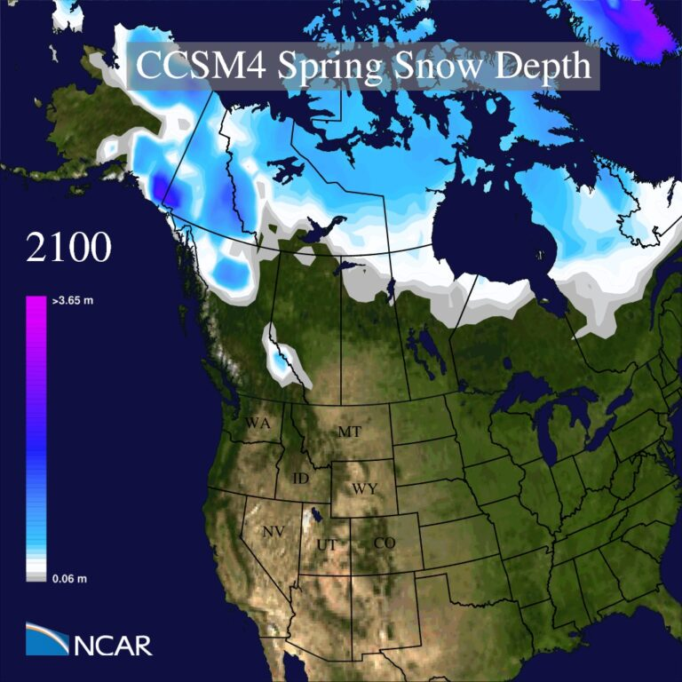
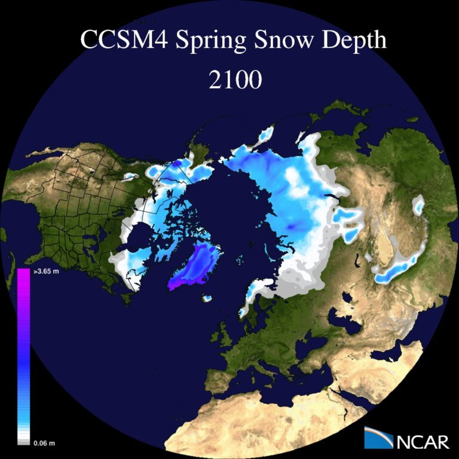

---
# Copy this file for a template that can then be placed in src/content/visualizations. The name of this file will be used as the URL for the post.

# String: full title of post.
title: "CCSM Spring Snow Cover"

# String (optional): shortened version of title for display on home page in card.
shortenedTitle: "Spring Snow Depth"

# String (optional, by default "VAST Staff"). Author of this post.
author: ""

# String in the form "December 10, 2019".
datePosted: "February 5, 2021" 

# String representing a valid path to an image. Used in the card on the main page. Likely to be in the form "/src/assets/..." for images located in src/assets.
coverImage: "/src/assets/ccsm-spring-snow-cover-1.jpg"

# The three following tag arrays are each an array of strings. Each string (case insensitive) represents a filter from the front page. Tags that do not correspond to a current filter will be ignored for filtering.

# options: atmosphere, climate, weather, oceans, sun-earth interactions, fire dynamics, solid earth, recent publications, experimental technologies
topicTags: ["atmosphere", "climate"]

# options: CAM, CESM, CM1, CMAQ, CT-ROMS, DIABLO Large Eddy Simulation, HRRR, HWRF, MPAS, SIMA, WACCM, WRF
modelTags: ["CCSM"]

# options: Blender, Maya, NCAR Command Language, ParaView, Visual Comparator, VAPOR
softwareTags: [""]

# Case insensitive string describing the main media type ("Video", "Image", "App", etc). This is displayed in the post heading as a small tag above the title.
mediaType: "Video"

# The following headings and subheadings are provided examples - unused ones can be deleted. All Markdown content below will be rendered in the frontend.
---

<iframe width="560" height="315" src="https://www.youtube.com/embed/r8L00AYyHqY?si=sKZLUUVxh22in4M6" title="YouTube video player" frameborder="0" allow="accelerometer; autoplay; clipboard-write; encrypted-media; gyroscope; picture-in-picture; web-share" referrerpolicy="strict-origin-when-cross-origin" allowfullscreen></iframe>

This visualization shows 4-year running means of snow cover over North America from 1853 to 2100. These visualizations were created using the Community Climate System Model (CCSM). Primary sponsors of CCSM are the National Science Foundation and the U.S. Department of Energy, Office of Science.

___

#### More Media

___

#### About the Science

##### Science Credits

Synte Peacock, NCAR

These simulations were made possible because of the large number of individuals both from within NCAR and the many outside collaborators who have contributed to the CCSM4 development and runs.

##### Computational Resources

Computing resources were provided by the Climate Simulation Laboratory at NCAR’s Computational and Information Systems Laboratory (CISL), sponsored by the National Science Foundation and other agencies. This research was enabled by CISL compute and storage resources. Bluefire, a 4,064-processor IBM Power6 resource with a peak of 77 TeraFLOPS provided more than 7.5 million computing hours, the GLADE high-speed disk resources provided 0.4 PetaBytes of dedicated disk and CISL’s 12-PB HPSS archive provided over 1 PetaByte of storage in support of this research project.

___

#### About the Visualization

##### Visualization and Post-production

Tim Scheitlin, Ryan McVeigh, Dave Brown, Mary Haley, Don Middleton (NCAR)