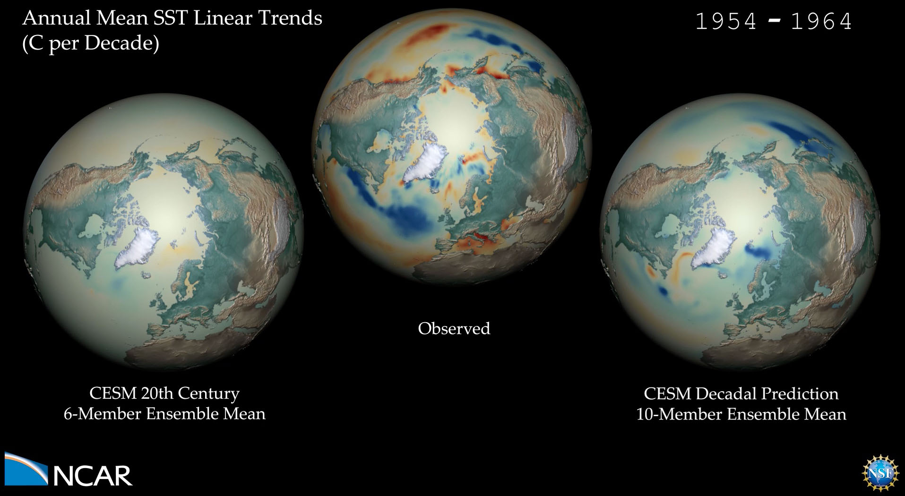

<iframe width="560" height="315" src="https://www.youtube.com/embed/hc9Lk3d6WSg?si=-2Ym8HMQmlldDhxE" title="YouTube video player" frameborder="0" allow="accelerometer; autoplay; clipboard-write; encrypted-media; gyroscope; picture-in-picture; web-share" referrerpolicy="strict-origin-when-cross-origin" allowfullscreen></iframe>

**Forecasting decadal trends in the North Atlantic and Arctic.** Decadal climate predictions exhibit skill in retrospective predictions of observed multi-year trends in sea surface temperature (SST) and sea ice fraction in the high latitudes of the Northern Hemisphere, particularly in the Atlantic sector. The skill is largely attributable to realistic ocean initialization, but external radiative forcing also contributes some skill. Here, we compare the spatiotemporal evolution of 10-year SST and sea ice fraction trends from the CESM Decadal Prediction Large Ensemble (CESM-DPLE; Yeager et al. 2018), which includes both initialization and external forcing, to historical trends diagnosed from the CESM Large Ensemble of 20th Century simulations (CESM-LE; Kay et al. 2015), which only includes external forcing effects. The observed SST data is from the HADISST1 product merged with the NOAA-OI product (Hurrell et al. 2008); the observed sea ice fraction data is from the National Snow & Ice Data Center (NSIDC) passive microwave product NSIDC-0051 (Cavalieri et al. 1996).

___

#### More Media

___

#### About the Visualization

##### Visualization and Post-production

Matt Rehme (NCAR)

___

#### More Information

##### References

Cavalieri, D. J., C. L. Parkinson, P. Gloersen, and H. J. Zwally. 1996, updated yearly. Sea Ice Concentrations from Nimbus-7 SMMR and DMSP SSM/I-SSMIS Passive Microwave Data, Version 1. Boulder, Colorado USA. NASA National Snow and Ice Data Center Distributed Active Archive Center. doi: https://doi.org/10.5067/8GQ8LZQVL0VL.

Kay, J.E., C. Deser, A. Phillips, A. Mai, C. Hannay, G. Strand, J. M. Arblaster, S. C. Bates, G. Danabasoglu, J. Edwards, M. Holland, P. Kushner, J.-F. Lamarque, D. Lawrence, K. Lindsay, A. Middleton, E. Munoz, R. Neale, K. Oleson, L. Polvani, and M. Vertenstein, 2015: The Community Earth System Model (CESM) Large Ensemble Project: A Community Resource for Studying Climate Change in the Presence of Internal Climate Variability. Bull. Am. Meteorol. Soc. 96, 1333–1349. https://doi.org/10.1175/BAMS-D-13-002….

Hurrell, J.W., J. J. Hack, D. Shea, J. M. Caron, J. Rosinski, 2008. A New Sea Surface Temperature and Sea Ice Boundary Dataset for the Community Atmosphere Model. J. Clim. 21, 5145–5153. https://doi.org/10.1175/2008JCLI2292.1.

Yeager, S. G., G. Danabasoglu, N. Rosenbloom, W. Strand, S. C. Bates, G. Meehl, A. Karspeck, K. Lindsay, M. C. Long, H. Teng, and N. Lovenduski, 2018: Predicting near-term changes in the Earth System: A large ensemble of initialized decadal prediction simulations using the Community Earth System Model. Bull. Amer. Meteor. Soc. doi:10.1175/BAMS-D-17-0098.1, in press.

##### Acknowledgements

This work was supported by the National Oceanic and Atmospheric Administration (NOAA) Climate Program Office under Climate Variability and Predictability Program grants NA09OAR4310163 and NA13OAR4310138, by the National Science Foundation (NSF) Collaborative Research EaSM2 grant OCE-1243015, and by the NSF through its sponsorship of the National Center for Atmospheric Research. The CESM-DPLE was generated using computational resources provided by the National Energy Research Scientific Computing Center, which is supported by the Office of Science of the U.S. Department of Energy under Contract No. DE-AC02-05CH11231, as well as by an Accelerated Scientific Discovery grant for Cheyenne (doi:10.5065/D6RX99HX) that was awarded by NCAR’s Computational and Information Systems Laboratory.
