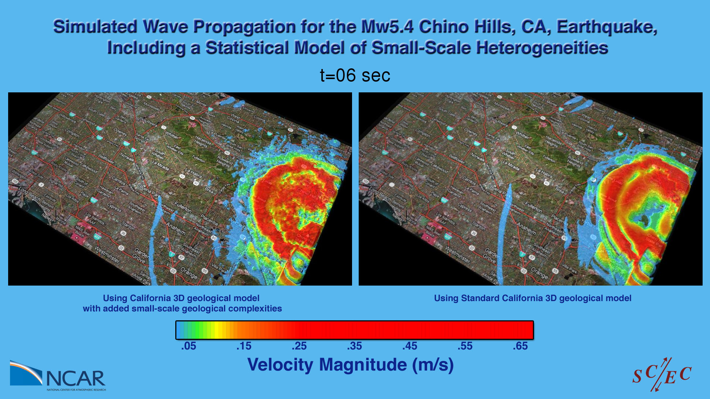

---
# Copy this file for a template that can then be placed in src/content/visualizations. The name of this file will be used as the URL for the post.

# String: full title of post.
title: "Chino Hills Earthquake"

# String (optional): shortened version of title for display on home page in card.
shortenedTitle: ""

# String (optional, by default "VAST Staff"). Author of this post.
author: ""

# String in the form "December 10, 2019".
datePosted: "September 11, 2012" 

# String representing a valid path to an image. Used in the card on the main page. Likely to be in the form "/src/assets/..." for images located in src/assets.
coverImage: "/src/assets/chino-hills-earthquake.jpg"

# The three following tag arrays are each an array of strings. Each string (case insensitive) represents a filter from the front page. Tags that do not correspond to a current filter will be ignored for filtering.

# options: atmosphere, climate, weather, oceans, sun-earth interactions, fire dynamics, solid earth, recent publications, experimental technologies
topicTags: ["solid earth"]

# options: CAM, CESM, CM1, CMAQ, CT-ROMS, DIABLO Large Eddy Simulation, HRRR, HWRF, MPAS, SIMA, WACCM, WRF
modelTags: [""]

# options: Blender, Maya, NCAR Command Language, ParaView, Visual Comparator, VAPOR
softwareTags: ["maya", "ncar command language"]

# Case insensitive string describing the main media type ("Video", "Image", "App", etc). This is displayed in the post heading as a small tag above the title.
mediaType: "Video"

# The following headings and subheadings are provided examples - unused ones can be deleted. All Markdown content below will be rendered in the frontend.
---

<iframe width="560" height="315" src="https://www.youtube.com/embed/4ij3XDLXHvg?si=gI4Vu1V8I-kUmd9p" title="YouTube video player" frameborder="0" allow="accelerometer; autoplay; clipboard-write; encrypted-media; gyroscope; picture-in-picture; web-share" referrerpolicy="strict-origin-when-cross-origin" allowfullscreen></iframe>

Southern California Earthquake Center (SCEC) researchers are working to improve ground motion simulations for California by developing more realistic small-scale models of the earth’s near-surface structure. The two animations shown in this visualization compare simulation results showing peak ground velocities at the earth’s surface for the M5.4 Chino Hills California earthquake. For the two simulations shown, all differences can be attributed to the impact of the geological structural models. The animation on the right shows a Chino Hills simulations with unmodified SCEC Community Velocity Model (CVM-S v11.2). The animation on the left shows a Chino Hills simulation that uses a modified version of CVM-S v11.2 that contains more realistic small-scale complexities. The animations show that the more complex velocity structure used in the left simulation, clearly impacts that ground motion distribution, the levels of peak ground motion, and the duration of shaking. The next scientific step is to compare both simulation results against observed data for this event to determine which velocity model most closely reproduces the observed ground motions for this earthquake.

___

#### More Media

 

___

#### About the Science

##### Science Credits

Kim B. Olsen, SDSU

William Savran, SDSU

Yifeng Cui, SDSC

Efecan Poyraz, SDSC

Philip Maechling, USC

Thomas H. Jordan, USC

##### Computational Resources

This research was enabled by NCAR/CISL compute resources. The simulation was run on Yellowstone, a 1.5-petaflops computing system with 72,288 processor cores.

##### Model

SCEC Community Velocity Model (CVM-S v11.2)

___

#### About the Visualization

##### Visualization and Post-production

Tim Scheitlin, NCAR

Perry Domingo, NCAR

##### Visualization Software

The NCAR Command Language (Version 6.1.1) [Software]. (2013). Boulder, Colorado: UCAR/NCAR/CISL/VETS. http://dx.doi.org/10.5065/D6WD3XH5
