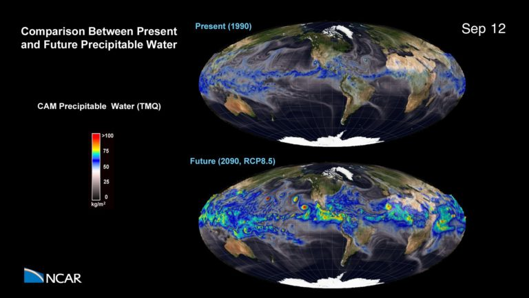
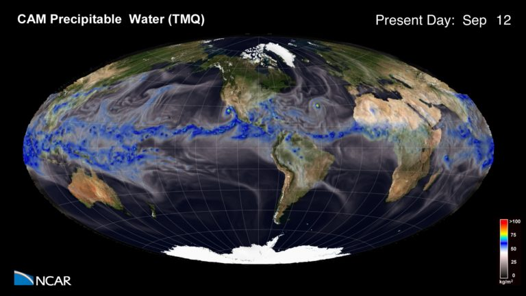
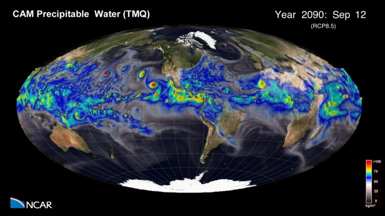

---
# Copy this file for a template that can then be placed in src/content/visualizations. The name of this file will be used as the URL for the post.

# String: full title of post.
title: "Climate Change: Precipitation"

# String (optional): shortened version of title for display on home page in card.
shortenedTitle: ""

# String (optional, by default "VAST Staff"). Author of this post.
author: ""

# String in the form "December 10, 2019".
datePosted: "November 13, 2018" 

# String representing a valid path to an image. Used in the card on the main page. Likely to be in the form "/src/assets/..." for images located in src/assets.
coverImage: "/src/assets/climate-change-precipitation-1.jpg"

# The three following tag arrays are each an array of strings. Each string (case insensitive) represents a filter from the front page. Tags that do not correspond to a current filter will be ignored for filtering.

# options: atmosphere, climate, weather, oceans, sun-earth interactions, fire dynamics, solid earth, recent publications, experimental technologies
topicTags: ["atmosphere", "climate"]

# options: CAM, CESM, CM1, CMAQ, CT-ROMS, DIABLO Large Eddy Simulation, HRRR, HWRF, MPAS, SIMA, WACCM, WRF
modelTags: ["CAM", "CESM"]

# options: Blender, Maya, NCAR Command Language, ParaView, Visual Comparator, VAPOR
softwareTags: ["Maya", "NCAR Command Language"]

# Case insensitive string describing the main media type ("Video", "Image", "App", etc). This is displayed in the post heading as a small tag above the title.
mediaType: "Video"

# The following headings and subheadings are provided examples - unused ones can be deleted. All Markdown content below will be rendered in the frontend.
---

<iframe width="560" height="315" src="https://www.youtube.com/embed/tm1w_FPosT4?si=7LbpXAtGxeyqEYLD" title="YouTube video player" frameborder="0" allow="accelerometer; autoplay; clipboard-write; encrypted-media; gyroscope; picture-in-picture; web-share" referrerpolicy="strict-origin-when-cross-origin" allowfullscreen></iframe>

This simulation shows a comparison between present day (1990) and future (2090) precipitable water in the Earth’s atmosphere using an RCP8.5 emissions scenario.

___

#### More Media

##### Present Day vs. Future Precipitation

##### Present Day Precipitable Water

##### Future Precipitable Water

___

#### About the Science

##### Science Credits

This simulation was made possible because of the large number of individuals both from within NCAR and the many outside collaborators who have contributed to the CESM development and runs.

##### Computational Resources

An award of computer time was provided by the Innovative and Novel Computational Impact on Theory and Experiment (INCITE) program. This research used resources of the Argonne Leadership Computing Facility at Argonne National Laboratory, which is supported by the office of Science of the U.S. Department of Energy under contract DE-AC02-06CH11357.

##### Model

The data for this visualization was generated by the Community Earth System Model (CESM) with a high resolution atmospheric model (0.25 degree) and specified ocean temperatures and sea ice. The CESM is a fully-coupled, global climate model that provides state-of-the-art computer simulations of the Earth’s past, present, and future climate states.  

CESM is sponsored by the National Science Foundation (NSF) and the U.S. Department of Energy (DOE).

___

#### About the Visualization

##### Visualization and Post-production

Tim Scheitlin and Matt Rehme (NCAR/CISL)

##### Visualization Software

The NCAR Command Language (Version 6.1.1) [Software]. (2013). Boulder, Colorado: UCAR/NCAR/CISL/VETS. http://dx.doi.org/10.5065/D6WD3XH5

___

#### More Information

##### Funding

This research was supported by the Regional and Global Climate Modeling Program (RGCM) of the U.S. Department of Energy’s, Office of Science (BER), Cooperative Agreement DE-FC02-97ER62402.

##### Acknowledgements

Earth imagery is courtesy of the NASA Visible Earth Project.

