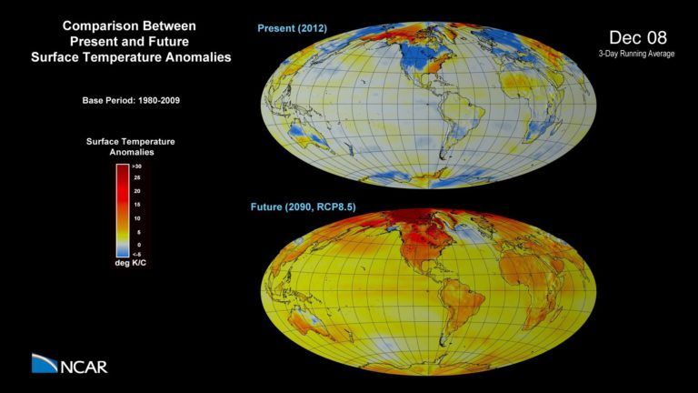

---
# Copy this file for a template that can then be placed in src/content/visualizations. The name of this file will be used as the URL for the post.

# String: full title of post.
title: "Climate Change: Temperature Anomalies"

# String (optional): shortened version of title for display on home page in card.
shortenedTitle: "Climate Change: Temperature"

# String (optional, by default "VAST Staff"). Author of this post.
author: ""

# String in the form "December 10, 2019".
datePosted: "May 12, 2015" 

# String representing a valid path to an image. Used in the card on the main page. Likely to be in the form "/src/assets/..." for images located in src/assets.
coverImage: "/src/assets/climate-change-temperature-anomalies.jpg"

# The three following tag arrays are each an array of strings. Each string (case insensitive) represents a filter from the front page. Tags that do not correspond to a current filter will be ignored for filtering.

# options: atmosphere, climate, weather, oceans, sun-earth interactions, fire dynamics, solid earth, recent publications, experimental technologies
topicTags: ["atmosphere", "climate"]

# options: CAM, CESM, CM1, CMAQ, CT-ROMS, DIABLO Large Eddy Simulation, HRRR, HWRF, MPAS, SIMA, WACCM, WRF
modelTags: ["CESM"]

# options: Blender, Maya, NCAR Command Language, ParaView, Visual Comparator, VAPOR
softwareTags: ["Maya", "NCAR Command Language"]

# Case insensitive string describing the main media type ("Video", "Image", "App", etc). This is displayed in the post heading as a small tag above the title.
mediaType: "Video"

# The following headings and subheadings are provided examples - unused ones can be deleted. All Markdown content below will be rendered in the frontend.
---

<iframe width="560" height="315" src="https://www.youtube.com/embed/vzPCDfbgF5I?si=T2VSsO9c1Mmxuhw_" title="YouTube video player" frameborder="0" allow="accelerometer; autoplay; clipboard-write; encrypted-media; gyroscope; picture-in-picture; web-share" referrerpolicy="strict-origin-when-cross-origin" allowfullscreen></iframe>

A comparison between present and future (RCP8.5) surface temperature anomalies. 

 

A 3-day smoothing has been applied to the output to dampen day to day variability.

___

#### More Media

___

#### About the Science

##### Computational Modeling

Nan Rosenbloom and Gary Strand (NCAR/CGD)

##### Model

CESM

___

#### About the Visualization

##### Visualization and Post-production

Tim Scheitlin and Matt Rehme (NCAR/CISL)

##### Visualization Software

NCAR Command Language.

___

#### More Information

##### Acknowledgements

This simulation was made possible with help from numerous individuals within NCAR and from many outside collaborators who contribute to the CESM development and production runs. 

 

The Community Earth System Model (CESM) is a fully-coupled, global climate model that provides state-of-the-art computer simulations of Earth’s past, present, and future climate states. 

 

The National Center for Atmospheric Research is sponsored by the National Science Foundation.
