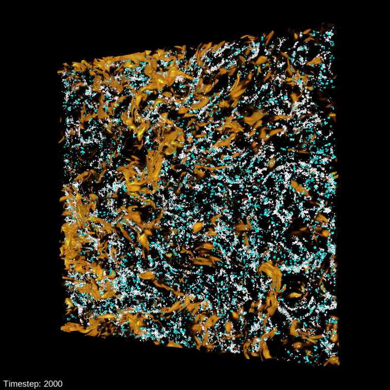

---
# Copy this file for a template that can then be placed in src/content/visualizations. The name of this file will be used as the URL for the post.

# String: full title of post.
title: "Coalescing Droplets in Turbulence"

# String (optional): shortened version of title for display on home page in card.
shortenedTitle: ""

# String (optional, by default "VAST Staff"). Author of this post.
author: ""

# String in the form "December 10, 2019".
datePosted: "October 20, 2020" 

# String representing a valid path to an image. Used in the card on the main page. Likely to be in the form "/src/assets/..." for images located in src/assets.
coverImage: "/src/assets/coalescing-droplets-in-turbulence.png"

# The three following tag arrays are each an array of strings. Each string (case insensitive) represents a filter from the front page. Tags that do not correspond to a current filter will be ignored for filtering.

# options: atmosphere, climate, weather, oceans, sun-earth interactions, fire dynamics, solid earth, recent publications, experimental technologies
topicTags: ["atmosphere", "weather"]

# options: CAM, CESM, CM1, CMAQ, CT-ROMS, DIABLO Large Eddy Simulation, HRRR, HWRF, MPAS, SIMA, WACCM, WRF
modelTags: [""]

# options: Blender, Maya, NCAR Command Language, ParaView, Visual Comparator, VAPOR
softwareTags: ["vapor"]

# Case insensitive string describing the main media type ("Video", "Image", "App", etc). This is displayed in the post heading as a small tag above the title.
mediaType: "Video"

# The following headings and subheadings are provided examples - unused ones can be deleted. All Markdown content below will be rendered in the frontend.
---

<iframe width="560" height="315" src="https://www.youtube.com/embed/J2HxkFq5T_A?si=g5NVTcdT1N1DrgNg" title="YouTube video player" frameborder="0" allow="accelerometer; autoplay; clipboard-write; encrypted-media; gyroscope; picture-in-picture; web-share" referrerpolicy="strict-origin-when-cross-origin" allowfullscreen></iframe>

Precipitation in warm clouds can be explained by coalescing water droplets. This coalescence can be accelerated by turbulent vortices within the cloud. In this visualization, we see how this turbulence drives the coalescence of large and small droplets.

___

#### More Media

 

___

#### About the Science

##### Science Credits

Melanie Li Sing How (Cornell), Lance Collins (Cornell)

##### Computational Modeling

Melanie Li Sing How (Cornell), simulated on NCAR’s Cheyenne Supercomputer

##### Computational Resources

This research was enabled by NCAR’s Computational and Information Systems Laboratory (CISL) compute and storage resources. This visualization shows a portion of a 7 million core hour set of simulations. Data stored on NCAR’s “glade” filesystem, and visualized on NCAR’s Casper visualization cluster.

##### Data Source

Melanie Li Sing How (Cornell)

___

#### About the Visualization

##### Visualization and Post-production

Scott Pearse (NCAR), Matt Rehme (NCAR)

##### Visualization Software

VAPOR