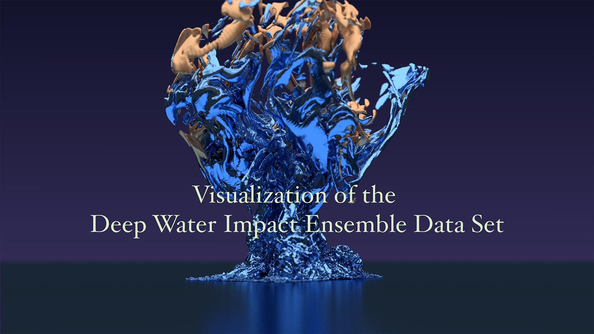
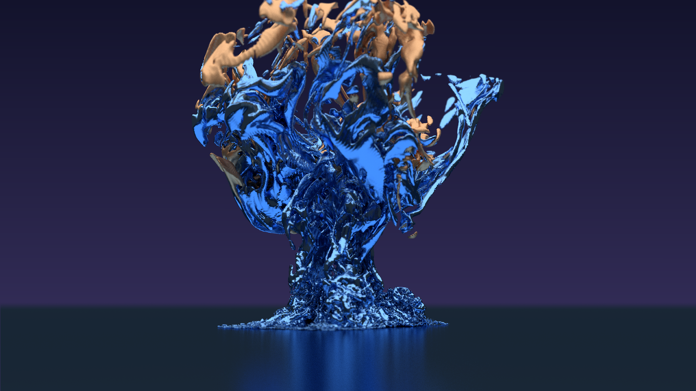

<iframe width="560" height="315" src="https://www.youtube.com/embed/o1gSByQVJ2s?si=vmQkkdRmeiZkbOCC" title="YouTube video player" frameborder="0" allow="accelerometer; autoplay; clipboard-write; encrypted-media; gyroscope; picture-in-picture; web-share" referrerpolicy="strict-origin-when-cross-origin" allowfullscreen></iframe>

The Deep Water Impact Ensemble Data Set was generated from large simulations of asteroids crashing into the ocean. These simulations were run using various sizes of asteroids and angles of entry in order to study the aftermath of the impacts. The data set was the subject matter for the 2018 IEEE VIS SciVis Contest, held in Berlin, Germany. This particular visualization compares the water fraction, asteroid fraction, and pressure variables for two ensemble runs: one where there is no airburst (the full asteroid impacts the ocean), and one where there is an airburst (the asteroid breaks apart before impact). The movie won third place honorable mention in the 2018 contest.

___

#### More Media

___

#### About the Visualization

##### Visualization and Post-production

Matt Rehme (National Center for Atmospheric Research)

##### Visualization Software

Rendering Software: [Blender](www.blender.org) & [ParaView](www.paraview.org)

___

#### More Information

##### Acknowledgements

The National Center for Atmospheric Research is sponsored by the National Science Foundation. © 2018 UCAR Any opinions, findings and conclusions, or recommendations expressed in this material are those of the author(s) and do not necessarily reflect the views of the National Science Foundation.

Asteroid Impact Simulation, IEEE SciVis Contest 2018

##### Further Information

Deep Water Impact Ensemble Data Set, Galen R. Gisler and John M. Patchett