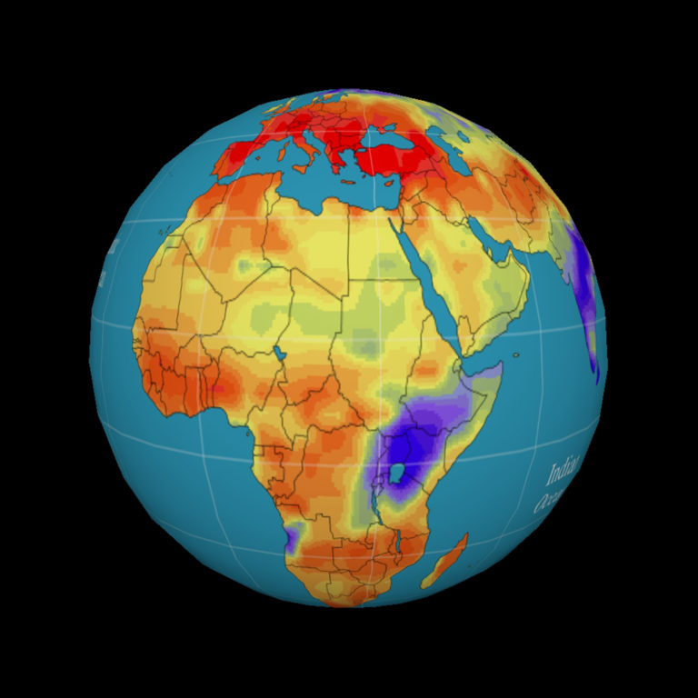

---
# Copy this file for a template that can then be placed in src/content/visualizations.
# String: full title of post.
title: "Drought Potential in the 21st Century"

# String (optional): shortened version of title for display on home page in card.
shortenedTitle: "Palmer Drought Severity Index"

# String (optional, by default "VAST Staff"). Author of this post.
author: ""

# String in the form "December 10, 2019".
datePosted: "August 28, 2018" 

# String representing a valid URL to an image. Used in the card on the main page.
coverImage: "/src/assets/drought-potential-in-the-21st-century.jpg"

# Array of strings. Each string (case insensitive) represents a filter from the front page. Tags that do not correspond to a current filter will be ignored for filtering.
topicTags: ["atmosphere", "climate"]
modelTags: [""]
softwareTags: [""]

# String describing the main media type ("Video", "Image", "App", etc). Is displayed in the post heading as a small tag.
mediaType: "Video"

# The following headings and subheadings are provided examples - unused ones can be deleted.
---

<iframe width="560" height="315" src="https://www.youtube.com/embed/V3gWPlloTxw?si=Dr68oiJzjcexoffE" title="YouTube video player" frameborder="0" allow="accelerometer; autoplay; clipboard-write; encrypted-media; gyroscope; picture-in-picture; web-share" referrerpolicy="strict-origin-when-cross-origin" allowfullscreen></iframe>

The United States and many other heavily populated countries face a growing threat of severe and prolonged drought in coming decades, according to a new study by National Center for Atmospheric Research (NCAR) scientist Aiguo Dai. The detailed analysis concludes that warming temperatures associated with climate change will likely create increasingly dry conditions across much of the globe in the next 30 years, possibly reaching a scale in some regions by the end of the century that has rarely, if ever, been observed in modern times. The movie shows the evolution of the annual mean self-calibrated Palmer Drought Severity Index (PDSI), a measure of meteorological drought, calculated using surface meteorological data from multiple models of the CMIP3 project under a moderate emissions scenario (A1B) and the Penman-Monteith equation for potential evapotranspiration. Negative values are for dry conditions and values below -3 are considered severe to extreme drought by today’s standard.

___

#### More Media

___

#### About the Science

##### Model

Multiple models from the CMIP3 project

##### Data Source

CMIP3

___

#### About the Visualization

##### Visualization

Tim Scheitlin

___

#### More Information

##### Further Information

[Palmer Drought Severity Index (PDSI)](https://climatedataguide.ucar.edu/climate-data/palmer-drought-severity-index-pdsi)

Dai, A., 2011: Drought under global warming: A review. Wiley Interdisciplinary Reviews: Climate Change, 2, 45-65. DOI: 10.1002/wcc.81.

Dai, A., 2013: Increasing drought under global warming in observations and models. Nature Climate Change. 3: 52-58. doi:10.1038/nclimate1633
