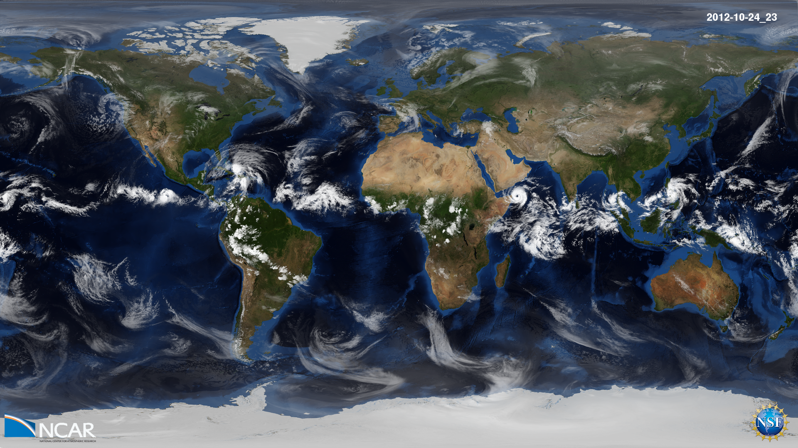

---
# Copy this file for a template that can then be placed in src/content/visualizations. The name of this file will be used as the URL for the post.

# String: full title of post.
title: "Global weather simulated by a cloud-resolving weather prediction model"

# String (optional): shortened version of title for display on home page in card.
shortenedTitle: "Global Weather Simulation"

# String (optional, by default "VAST Staff"). Author of this post.
author: ""

# String in the form "December 10, 2019".
datePosted: "November 12, 2017" 

# String representing a valid path to an image. Used in the card on the main page. Likely to be in the form "/src/assets/..." for images located in src/assets.
coverImage: "/src/assets/global-weather-simulated-by-a-cloud-resolving-weather-prediction-model-1.png"

# The three following tag arrays are each an array of strings. Each string (case insensitive) represents a filter from the front page. Tags that do not correspond to a current filter will be ignored for filtering.

# options: atmosphere, climate, weather, oceans, sun-earth interactions, fire dynamics, solid earth, recent publications, experimental technologies
topicTags: ["atmosphere", "weather"]

# options: CAM, CESM, CM1, CMAQ, CT-ROMS, DIABLO Large Eddy Simulation, HRRR, HWRF, MPAS, SIMA, WACCM, WRF
modelTags: ["MPAS"]

# options: Blender, Maya, NCAR Command Language, ParaView, Visual Comparator, VAPOR
softwareTags: ["NCAR Command Language"]

# Case insensitive string describing the main media type ("Video", "Image", "App", etc). This is displayed in the post heading as a small tag above the title.
mediaType: "Video"

# The following headings and subheadings are provided examples - unused ones can be deleted. All Markdown content below will be rendered in the frontend.
---

<iframe width="560" height="315" src="https://www.youtube.com/embed/UmiB4Ynd9AI?si=Tx3KZH8xIO_pIINF" title="YouTube video player" frameborder="0" allow="accelerometer; autoplay; clipboard-write; encrypted-media; gyroscope; picture-in-picture; web-share" referrerpolicy="strict-origin-when-cross-origin" allowfullscreen></iframe>

The global weather from 20 October – 4 November 2012, simulated by a cloud-resolving weather prediction model.

 

Model: MPAS

  

Variable: Outgoing Longwave Radiation

 

Science: The complex evolution of multiscale cloud systems illustrates the myriad of weather phenomena that populate our atmosphere. Features of interest include the diurnal cycle of convection over central Africa and the Amazon rain forest; the birth, intensification, and demise of tropical cyclones in the Indian Ocean and Western Pacific; the recurring developments of extratropical cyclones along the midlatitude jet streams; and the formation of orographic clouds downstream of the Rocky Mountains.

 

The simulation was created with the Model for Prediction Across Scales (MPAS), a collaborative project for developing atmosphere, ocean and other earth-system simulation components for use in climate, regional climate and weather studies. The primary development partners are the climate modeling group at Los Alamos National Laboratory (COSIM) and the National Center for Atmospheric Research.

 

For this experiment, MPAS was configured with a horizontal resolution of 4 km and 55 vertical levels. This resolution allows for the explicit simulation of deep convection (i.e., heavy rain showers and thunderstorms), facilitating the seamless prediction of weather from local to planetary scales. The animation time step is 12 min.

___

#### More Media

 

___

#### About the Science

##### Science Credits

Dr. Falko Judt (NCAR ASP Postdoc)

##### Computational Resources

This research was made possible with an NCAR Strategic Capabilities 3-million core-hour allocation, and facilitated by NCAR’s CISL compute, visualization, and storage resources, including Yellowstone, a 1.5 petaflops high-performance IBM iDataPlex cluster at the NCAR-Wyoming Supercomputer Center in Cheyenne, Wyoming.

##### Model

The Model for Prediction Across Scales (MPAS) is a collaborative project for developing atmosphere, ocean and other earth-system simulation components for use in climate, regional climate and weather studies.

___

#### About the Visualization

##### Visualization and Post-production

Tim Scheitlin (NCAR/CISL)

##### Visualization Software

The NCAR Command Language (Version 6.4.0) [Software]. (2017). Boulder, Colorado: UCAR/NCAR/CISL/TDD. http://dx.doi.org/10.5065/D6WD3XH5

___

#### More Information

##### Acknowledgements

Earth imagery is courtesy of the NASA Visible Earth Project.
