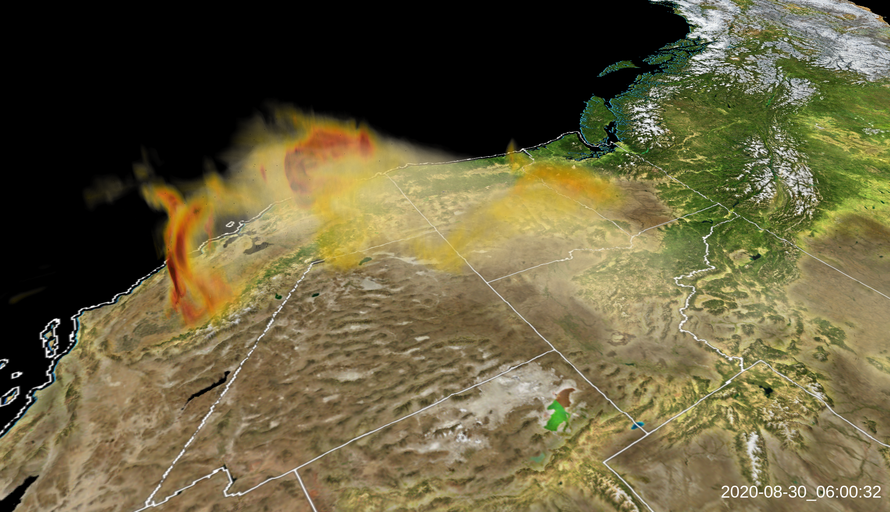
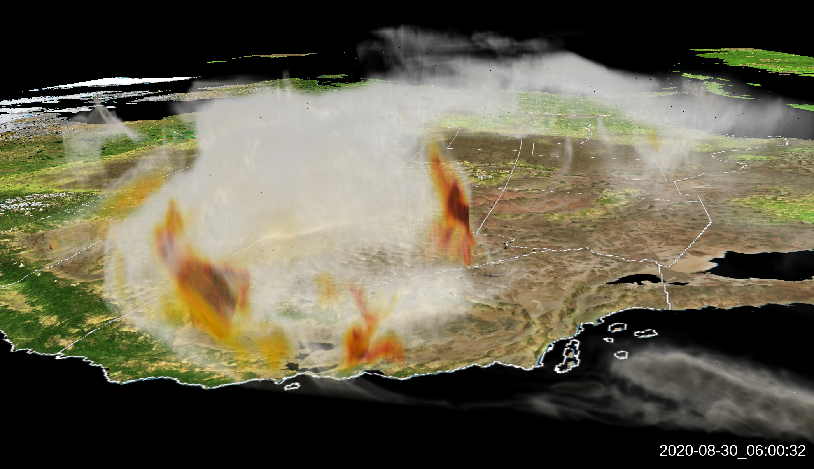
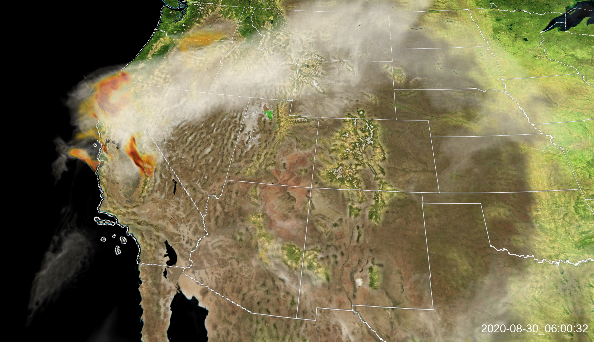

---
# Copy this file for a template that can then be placed in src/content/visualizations. The name of this file will be used as the URL for the post.

# String: full title of post.
title: "HRRR Smoke in the Summer of 2020"

# String (optional): shortened version of title for display on home page in card.
shortenedTitle: ""

# String (optional, by default "VAST Staff"). Author of this post.
author: ""

# String in the form "December 10, 2019".
datePosted: "September 21, 2020" 

# String representing a valid path to an image. Used in the card on the main page. Likely to be in the form "/src/assets/..." for images located in src/assets.
coverImage: "/src/assets/hrrr-smoke-in-the-summer-of-2020-1.png"

# The three following tag arrays are each an array of strings. Each string (case insensitive) represents a filter from the front page. Tags that do not correspond to a current filter will be ignored for filtering.

# options: atmosphere, climate, weather, oceans, sun-earth interactions, fire dynamics, solid earth, recent publications, experimental technologies
topicTags: ["atmosphere", "fire dynamics"]

# options: CAM, CESM, CM1, CMAQ, CT-ROMS, DIABLO Large Eddy Simulation, HRRR, HWRF, MPAS, SIMA, WACCM, WRF
modelTags: ["hrrr"]

# options: Blender, Maya, NCAR Command Language, ParaView, Visual Comparator, VAPOR
softwareTags: ["vapor"]

# Case insensitive string describing the main media type ("Video", "Image", "App", etc). This is displayed in the post heading as a small tag above the title.
mediaType: "Video"

# The following headings and subheadings are provided examples - unused ones can be deleted. All Markdown content below will be rendered in the frontend.
---

<iframe width="560" height="315" src="https://www.youtube.com/embed/wZ2OktM9p_k?si=Qa2R3Q8P0mk4Pg4h" title="YouTube video player" frameborder="0" allow="accelerometer; autoplay; clipboard-write; encrypted-media; gyroscope; picture-in-picture; web-share" referrerpolicy="strict-origin-when-cross-origin" allowfullscreen></iframe>

These volume renderings show the simulated dispersal of smoke generated with the High Resolution Rapid Refresh (HRRR) model. This visualization emphasizes the Western wildfires during the last days of August 2020. Science credit to Ka Yee Wong and Ravan Ahmadov, of NOAA’s Global Systems Laboratory.

___

#### More Media

##### HRRR Smoke 2020

##### HRRR Smoke Looking West

##### HRRR Smoke Looking East

##### HRRR Smoke Above

___

#### About the Science

##### Science Credits

Ka Yee Wong (NOAA GSL)

Ravan Ahmadov (NOAA GSL)

##### Computational Modeling

Ka Yee Wong (NOAA GSL)

Ravan Ahmadov (NOAA GSL)

##### Computational Resources

NOAA’s JET Cluster

##### Model

HRRR

___

#### About the Visualization

##### Visualization and Post-production

Scott Pearse (NCAR)

##### Visualization Software

VAPOR