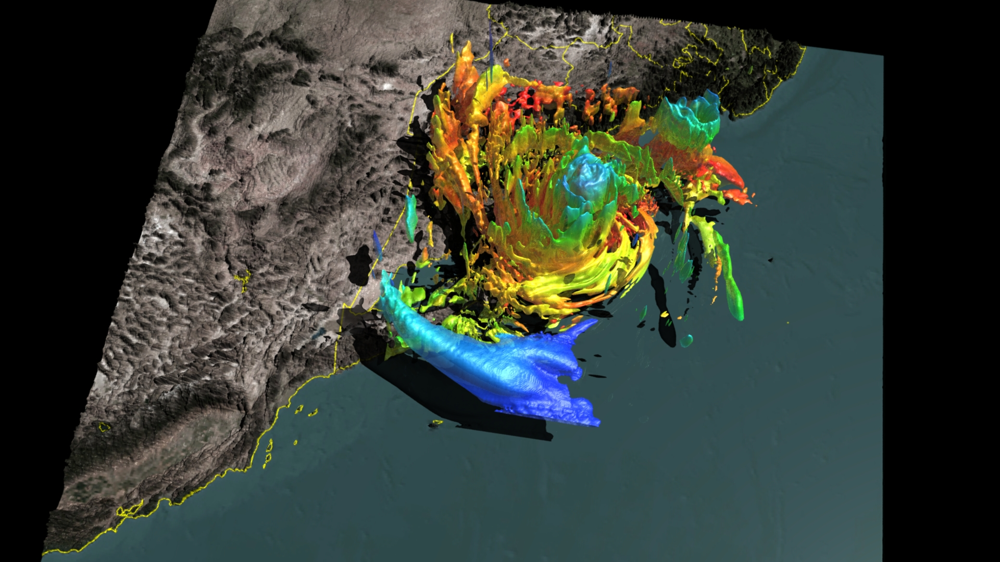
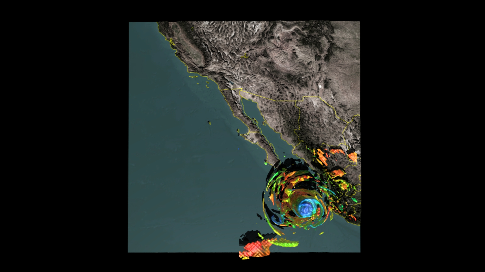
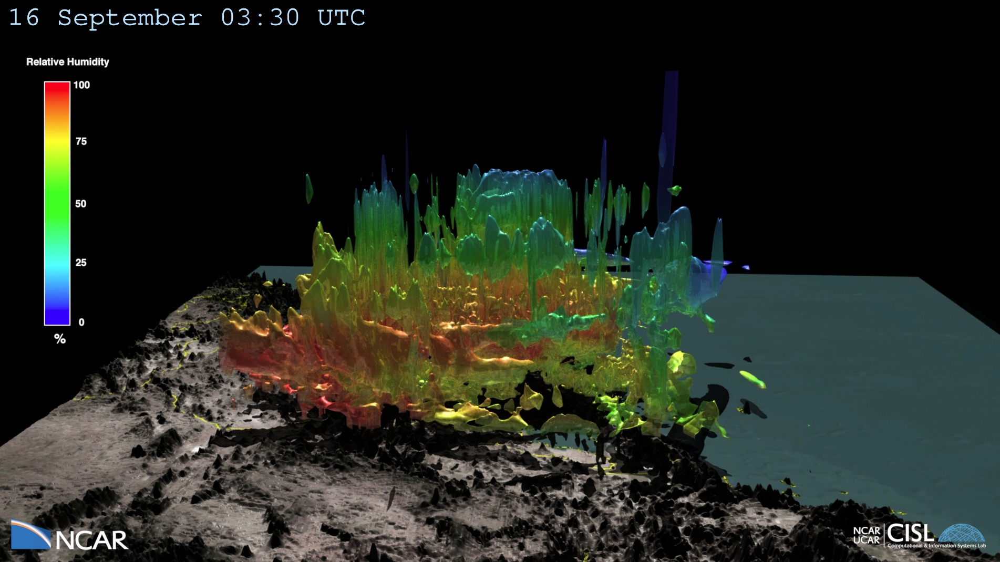

---
# Copy this file for a template that can then be placed in src/content/visualizations. The name of this file will be used as the URL for the post.

# String: full title of post.
title: "Hurricane Odile"

# String (optional): shortened version of title for display on home page in card.
shortenedTitle: ""

# String (optional, by default "VAST Staff"). Author of this post.
author: ""

# String in the form "December 10, 2019".
datePosted: "August 29, 2018" 

# String representing a valid path to an image. Used in the card on the main page. Likely to be in the form "/src/assets/..." for images located in src/assets.
coverImage: "/src/assets/hurricane-odile-1.jpg"

# The three following tag arrays are each an array of strings. Each string (case insensitive) represents a filter from the front page. Tags that do not correspond to a current filter will be ignored for filtering.

# options: atmosphere, climate, weather, oceans, sun-earth interactions, fire dynamics, solid earth, recent publications, experimental technologies
topicTags: ["atmosphere", "weather"]

# options: CAM, CESM, CM1, CMAQ, CT-ROMS, DIABLO Large Eddy Simulation, HRRR, HWRF, MPAS, SIMA, WACCM, WRF
modelTags: ["HWRF"]

# options: Blender, Maya, NCAR Command Language, ParaView, Visual Comparator, VAPOR
softwareTags: [""]

# Case insensitive string describing the main media type ("Video", "Image", "App", etc). This is displayed in the post heading as a small tag above the title.
mediaType: "Video"

# The following headings and subheadings are provided examples - unused ones can be deleted. All Markdown content below will be rendered in the frontend.
---

<iframe width="560" height="315" src="https://www.youtube.com/embed/t2SVpgNlJVE?si=u1XITvY0-wFmfL1E" title="YouTube video player" frameborder="0" allow="accelerometer; autoplay; clipboard-write; encrypted-media; gyroscope; picture-in-picture; web-share" referrerpolicy="strict-origin-when-cross-origin" allowfullscreen></iframe>

Hurricane Odile swept across the Baja California Peninsula in September 2014, leaving behind widespread damage, flooding, and power outages. It reached category 4 intensity before weakening as it tracked across the length of the peninsula. This visualization is a 15-minute Hurricane Weather Research Forecast (HWRF) simulation (1251x1251x61) of Hurricane Odile shortly after it made landfall. The surface represents absolute vorticity (12e-5 s-1) colored by relative humidity. NOAA’s HWRF system is an advanced hurricane prediction system that has the capability to address intensity, structure, and rainfall forecast problems. It is currently used to provide real time numerical guidance in all oceanic basins. The HWRF system is an atmosphere-ocean model configured with a parent grid (~27 km) and two telescopic (~9 and ~3 km) high-resolution, movable 2-way nested grids that follow the storm. There are 61 vertical levels. It utilizes a Gridpoint Statistical Interpolation (GSI) Hybrid ensemble-variational data assimilation scheme to assimilate NOAA P3’s tail Doppler radar, dropsonde data, conventional observations, and satellite radiances.

___

#### More Media

 

___

#### About the Science

##### Computational Modeling

Mrinal Biswas (NCAR/RAL/DTC)

##### Model

HWRF
___

#### About the Visualization

##### Visualization and Post-production

Tim Scheitlin and Matt Rehme (NCAR/CISL)

___

#### More Information

##### Acknowledgements

David Gochis (NCAR/RAL), Mary Haley (NCAR/CISL), Dennis Shea (NCAR/CGD), Richard Valent (NCAR/CISL), and Jonathan Vigh (NCAR/RAL)

 

This visualization was enabled by NCAR’s Computational and Information Systems Laboratory (CISL) compute an storage resources, including Yellowstone, Geyser, Caldera and Glade.  Funding for this visualization was provided by NCAR’s Research Applications Laboratory (RAL).