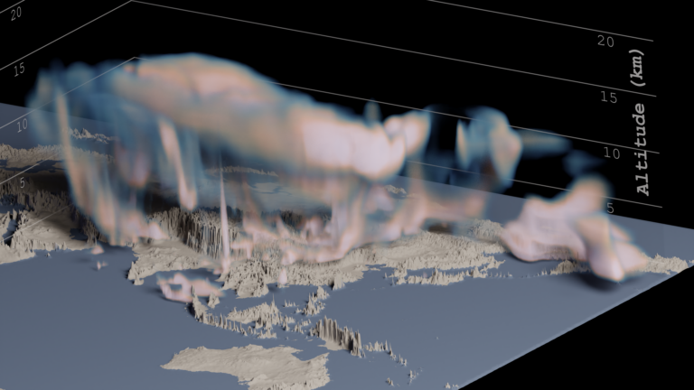

---
# Copy this file for a template that can then be placed in src/content/visualizations. The name of this file will be used as the URL for the post.

# String: full title of post.
title: "Impact of the Asian Summer Monsoon on the Composition of the Upper Troposphere and Lower Stratosphere"

# String (optional): shortened version of title for display on home page in card.
shortenedTitle: "Asian Summer Monsoon"

# String (optional, by default "VAST Staff"). Author of this post.
author: "Matt Rehme"

# String in the form "December 10, 2019".
datePosted: "July 20, 2022" 

# String representing a valid path to an image. Used in the card on the main page. Likely to be in the form "/src/assets/..." for images located in src/assets.
coverImage: "/src/assets/impact-of-the-asian-summer-monsoon-on-the-composition-of-the-upper-troposphere-and-lower-stratosphere.png"

# The three following tag arrays are each an array of strings. Each string (case insensitive) represents a filter from the front page. Tags that do not correspond to a current filter will be ignored for filtering.

# options: atmosphere, climate, weather, oceans, sun-earth interactions, fire dynamics, solid earth, recent publications, experimental technologies
topicTags: ["atmosphere", "weather"]

# options: CAM, CESM, CM1, CMAQ, CT-ROMS, DIABLO Large Eddy Simulation, HRRR, HWRF, MPAS, SIMA, WACCM, WRF
modelTags: [""]

# options: Blender, Maya, NCAR Command Language, ParaView, Visual Comparator, VAPOR
softwareTags: ["Blender", "OpenVDB"]

# Case insensitive string describing the main media type ("Video", "Image", "App", etc). This is displayed in the post heading as a small tag above the title.
mediaType: "Video"

# The following headings and subheadings are provided examples - unused ones can be deleted. All Markdown content below will be rendered in the frontend.
---

<iframe width="560" height="315" src="https://www.youtube.com/embed/yEFARLvyGPg?si=t3qwpWbAzEc-ga_a" title="YouTube video player" frameborder="0" allow="accelerometer; autoplay; clipboard-write; encrypted-media; gyroscope; picture-in-picture; web-share" referrerpolicy="strict-origin-when-cross-origin" allowfullscreen></iframe>

This visualization depicts carbon monoxide (CO) concentration over Asian. The data were generated from a simulation of 2021. The visualization coincides with the upcoming (July – August 2022) Asian Summer Monsoon Chemical and Climate Impact Project (ACCLIP). The scientists will fly from Osan, South Korea, over eastern Asia and the Pacific to gather similar data from the environment, then compare the results to the simulated data. See more here: https://www2.acom.ucar.edu/acclip

___

#### More Media

  

___

#### About the Science

##### Science Credits

Ren Smith (NCAR/ACOM), Jun Zhang (NCAR/ASP), Shawn Honomichl (NCAR/ACOM)

##### Computational Modeling

Ren Smith (NCAR/ACOM), Jun Zhang (NCAR/ASP), Shawn Honomichl (NCAR/ACOM)

___

#### About the Visualization

##### Visualization and Post-production

Matt Rehme (NCAR/CISL)

##### Visualization Software

Python, Blender, OpenVDB

___

#### More Information

##### Further Information

https://www2.acom.ucar.edu/acclip
