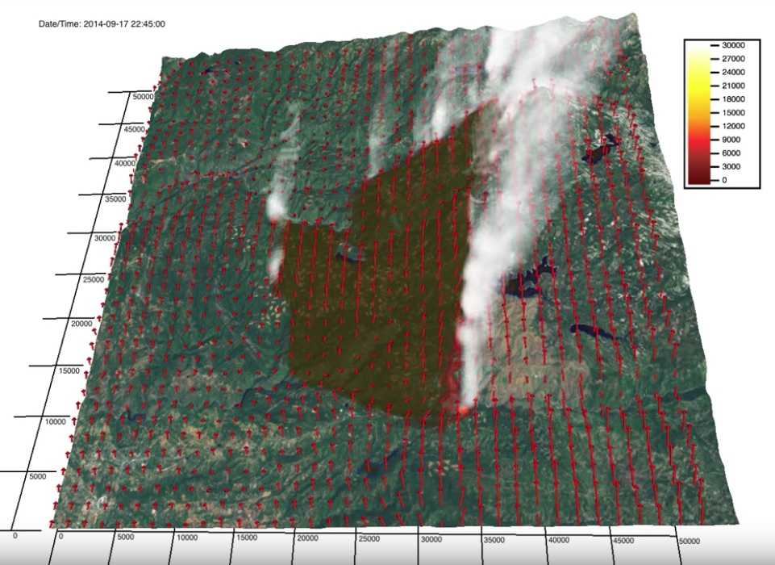

---
# Copy this file for a template that can then be placed in src/content/visualizations. The name of this file will be used as the URL for the post.

# String: full title of post.
title: "King Fire 2014"

# String (optional): shortened version of title for display on home page in card.
shortenedTitle: ""

# String (optional, by default "VAST Staff"). Author of this post.
author: ""

# String in the form "December 10, 2019".
datePosted: "October 16, 2018" 

# String representing a valid path to an image. Used in the card on the main page. Likely to be in the form "/src/assets/..." for images located in src/assets.
coverImage: "/src/assets/king-fire-2014.jpeg"

# The three following tag arrays are each an array of strings. Each string (case insensitive) represents a filter from the front page. Tags that do not correspond to a current filter will be ignored for filtering.

# options: atmosphere, climate, weather, oceans, sun-earth interactions, fire dynamics, solid earth, recent publications, experimental technologies
topicTags: ["fire dynamics"]

# options: CAM, CESM, CM1, CMAQ, CT-ROMS, DIABLO Large Eddy Simulation, HRRR, HWRF, MPAS, SIMA, WACCM, WRF
modelTags: [""]

# options: Blender, Maya, NCAR Command Language, ParaView, Visual Comparator, VAPOR
softwareTags: ["vapor"]

# Case insensitive string describing the main media type ("Video", "Image", "App", etc). This is displayed in the post heading as a small tag above the title.
mediaType: "Video"

# The following headings and subheadings are provided examples - unused ones can be deleted. All Markdown content below will be rendered in the frontend.
---

<iframe width="560" height="315" src="https://www.youtube.com/embed/hFPvYN8EZcU?si=2tTHQIgRlI4DMhWW" title="YouTube video player" frameborder="0" allow="accelerometer; autoplay; clipboard-write; encrypted-media; gyroscope; picture-in-picture; web-share" referrerpolicy="strict-origin-when-cross-origin" allowfullscreen></iframe>

The King Fire was ignited on 9/13/14 in the Eldorado National Forest northeast of Pollock Pines, CA, where pine plantations lie between steep canyons. Eventhough fuel conditions were dry, environmental winds recorded at nearby weather stations were weak, thus rapid fire growth was not expected. On the 17th, the north-spreading fire reached the Rubicon canyon and ran approximately 15 miles upcanyon to the northeast in one day. This CAWFE™ simulation spans the evening of 9/16/14, during which the fire is ignited already in progress with the fire extent mapped by the 9:47 PM National Infrared Operations airborne imagery, until this growth period ends the morning of 9/18/14. The simulation captures the rapid growth, in which fire-induced winds draw the fire upcanyon, ceasing growth at Hell Hole Reservoir, the water body at the northeast end of the fire. 

___

#### More Media

 

___

#### About the Science

##### Science Credits

[Dr. Janice Coen](https://www2.mmm.ucar.edu/people/coen/) is a Project Scientist at the NSF National Center for Atmospheric Research in Boulder, Colorado.  She studies wildland fire behavior and its interaction with weather using coupled weather-fire computer simulation models and by analyzing infrared imagery of wildfires and prescribed fires.

___

#### About the Visualization

##### Visualization Software

VAPOR