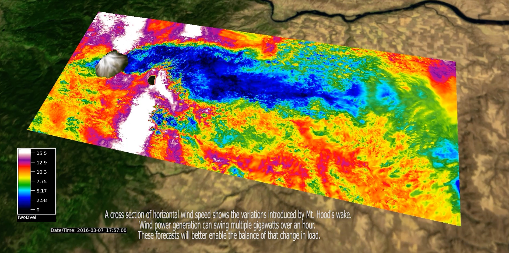

---
# Copy this file for a template that can then be placed in src/content/visualizations. The name of this file will be used as the URL for the post.

# String: full title of post.
title: "NSF NCAR’s Wind Forecast Improvement Project 2"

# String (optional): shortened version of title for display on home page in card.
shortenedTitle: ""

# String (optional, by default "VAST Staff"). Author of this post.
author: ""

# String in the form "December 10, 2019".
datePosted: "August 29, 2018" 

# String representing a valid path to an image. Used in the card on the main page. Likely to be in the form "/src/assets/..." for images located in src/assets.
coverImage: "/src/assets/ncars-wind-forecast-improvement-project-2.jpeg"

# The three following tag arrays are each an array of strings. Each string (case insensitive) represents a filter from the front page. Tags that do not correspond to a current filter will be ignored for filtering.

# options: atmosphere, climate, weather, oceans, sun-earth interactions, fire dynamics, solid earth, recent publications, experimental technologies
topicTags: ["atmosphere", "weather"]

# options: CAM, CESM, CM1, CMAQ, CT-ROMS, DIABLO Large Eddy Simulation, HRRR, HWRF, MPAS, SIMA, WACCM, WRF
modelTags: [""]

# options: Blender, Maya, NCAR Command Language, ParaView, Visual Comparator, VAPOR
softwareTags: ["vapor"]

# Case insensitive string describing the main media type ("Video", "Image", "App", etc). This is displayed in the post heading as a small tag above the title.
mediaType: "Video"

# The following headings and subheadings are provided examples - unused ones can be deleted. All Markdown content below will be rendered in the frontend.
---

<iframe width="560" height="315" src="https://www.youtube.com/embed/UVjWE7toK3A?si=WKLd7adhLFcnwf26" title="YouTube video player" frameborder="0" allow="accelerometer; autoplay; clipboard-write; encrypted-media; gyroscope; picture-in-picture; web-share" referrerpolicy="strict-origin-when-cross-origin" allowfullscreen></iframe>

By the end of 2016, the state of Oregon had an installed wind generating power capacity of over 3 Gigawatts. Wind power, while clean and renewable, requires constant load balancing due to variable weather conditions. These conditions must be met with state of the art forecasting methods in order to maximize load balancing efficiency. New techniques in Numerical Weather Prediction (NWP) have been developed to better optimize load balancing. Visualizations of these new NWP simulations show how winds behave on the leeward side of Mt. Hood. These winds generate a wake that affects Oregon wind farms; causing swings in power that require dynamic load balancing.

___

#### More Media

___

#### About the Science

##### Computational Modeling

Pedro Jimenez Munoz (NCAR)

Branko Kosovic (NCAR)

##### Model

Weather Research and Forecasting Model for Large Eddy Simulations (WRF-LES)

___

#### About the Visualization

##### Visualization and Post-production

Scott Pearse (NCAR)

##### Visualization Software

[VAPOR](https://www.vapor.ucar.edu/)