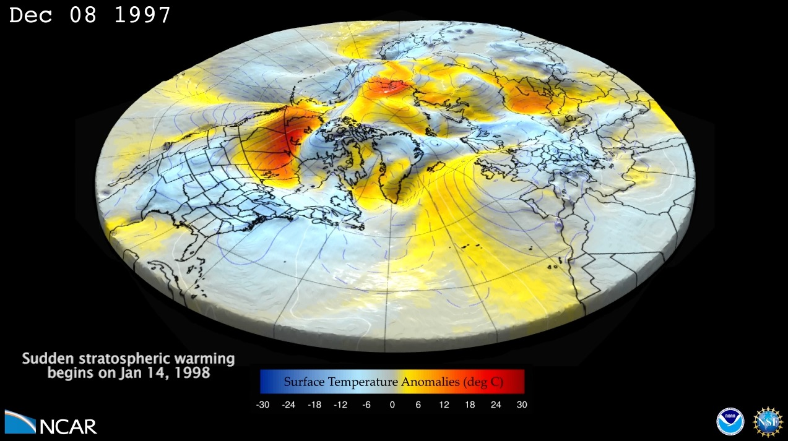

---
# Copy this file for a template that can then be placed in src/content/visualizations. The name of this file will be used as the URL for the post.

# String: full title of post.
title: "Negative North Atlantic Oscillation Triggered by Stratospheric Sudden Warming"

# String (optional): shortened version of title for display on home page in card.
shortenedTitle: "NAO Triggered by Stratospheric Warming"

# String (optional, by default "VAST Staff"). Author of this post.
author: ""

# String in the form "December 10, 2019".
datePosted: "November 13, 2016" 

# String representing a valid path to an image. Used in the card on the main page. Likely to be in the form "/src/assets/..." for images located in src/assets.
coverImage: "/src/assets/negative-nao-triggered-by-stratospheric-sudden-warming.jpg"

# The three following tag arrays are each an array of strings. Each string (case insensitive) represents a filter from the front page. Tags that do not correspond to a current filter will be ignored for filtering.

# options: atmosphere, climate, weather, oceans, sun-earth interactions, fire dynamics, solid earth, recent publications, experimental technologies
topicTags: ["atmosphere", "climate"]

# options: CAM, CESM, CM1, CMAQ, CT-ROMS, DIABLO Large Eddy Simulation, HRRR, HWRF, MPAS, SIMA, WACCM, WRF
modelTags: ["CAM", "CESM"]

# options: Blender, Maya, NCAR Command Language, ParaView, Visual Comparator, VAPOR
softwareTags: ["Maya", "NCAR Command Language"]

# Case insensitive string describing the main media type ("Video", "Image", "App", etc). This is displayed in the post heading as a small tag above the title.
mediaType: "Video"

# The following headings and subheadings are provided examples - unused ones can be deleted. All Markdown content below will be rendered in the frontend.
---

<iframe width="560" height="315" src="https://www.youtube.com/embed/ZjFtxeciPug?si=6U64-BlWwd9Fi1so" title="YouTube video player" frameborder="0" allow="accelerometer; autoplay; clipboard-write; encrypted-media; gyroscope; picture-in-picture; web-share" referrerpolicy="strict-origin-when-cross-origin" allowfullscreen></iframe>

Seasonal forecast for winter of 1997/1998 with 46LCAM (Ensemble member with a sudden stratospheric warming).

This is a 4 month forecast of surface geopotential height anomalies (shown with surface relief and contour lines) and surface temperature anomalies (shown with a color gradient). The forecast starts on Dec 1, 1997, and goes through the end of March, 1998. It illustrates the negative North Atlantic Oscillation (NAO) pattern that gets triggered by a stratospheric sudden warming.

The North Atlantic Oscillation (NAO) is a major fluctuation in atmospheric pressure over a large area in the northern Atlantic Ocean, and it affects weather conditions in the United States, Europe, and Asia. Stratospheric sudden warmings typically produce negative NAO patterns at the surface. A negative NAO is often associated with colder conditions in eastern North America and northern Europe brought on by more-frequent intrusions of Arctic air.

___

#### More Media

___

#### About the Science

##### Science Credits

Jadwiga H. Richter, NCAR

Lantao Sun, NOAA

##### Computational Resources

This research was enabled by NCAR’s Computational and Information Systems Laboratory (CISL)  compute and storage resources, including 700 hours on Yellowstone,  a 1.5-petaflops IBM iDataPlex supercomputer with 72,288 processor cores.

##### Model

Community Atmosphere Model (CAM) is the atmospheric component of the Community Earth System Model (CESM).  CESM is a fully-coupled, global climate model that provides state-of-the-art computer simulations of the Earth’s past, present, and future climate states.  CESM is sponsored by the National Science Foundation (NSF) and the U.S. Department of Energy (DOE).

___

#### About the Visualization

##### Visualization and Post-production

Tim Scheitlin and Matt Rehme (NCAR)

Special thanks to Mary Haley (NCAR)

##### Visualization Software

The NCAR Command Language (Version 6.3.0)  [Software]. (2016). Boulder, Colorado: UCAR/NCAR/CISL/TDD.  http://dx.doi.org/10.5065/D6WD3XH5

___

#### More Information

##### Acknowledgements

NCAR is sponsored by the National Science Foundation. Any opinions, findings and conclusions, or recommendations expressed in this material are those of the author(s) and do not necessarily reflect the views of the National Science Foundation.
