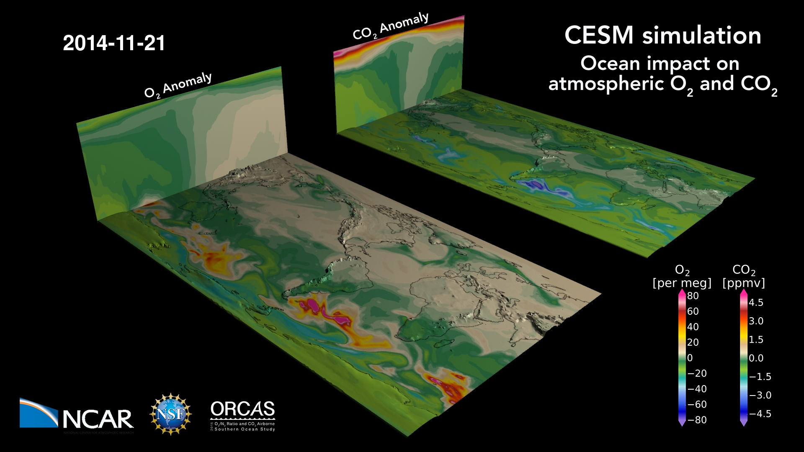

---
# Copy this file for a template that can then be placed in src/content/visualizations. The name of this file will be used as the URL for the post.

# String: full title of post.
title: "Ocean Impact on Atmospheric Oxygen and Carbon Dioxide"

# String (optional): shortened version of title for display on home page in card.
shortenedTitle: "Ocean Impact on Oxygen and Carbon Dioxide"

# String (optional, by default "VAST Staff"). Author of this post.
author: ""

# String in the form "December 10, 2019".
datePosted: "November 12, 2018" 

# String representing a valid path to an image. Used in the card on the main page. Likely to be in the form "/src/assets/..." for images located in src/assets.
coverImage: "/src/assets/ocean-impact-on-atmospheric-oxygen-and-carbon-dioxide.jpg"

# The three following tag arrays are each an array of strings. Each string (case insensitive) represents a filter from the front page. Tags that do not correspond to a current filter will be ignored for filtering.

# options: atmosphere, climate, weather, oceans, sun-earth interactions, fire dynamics, solid earth, recent publications, experimental technologies
topicTags: ["atmosphere", "oceans"]

# options: CAM, CESM, CM1, CMAQ, CT-ROMS, DIABLO Large Eddy Simulation, HRRR, HWRF, MPAS, SIMA, WACCM, WRF
modelTags: ["CESM"]

# options: Blender, Maya, NCAR Command Language, ParaView, Visual Comparator, VAPOR
softwareTags: ["Maya"]

# Case insensitive string describing the main media type ("Video", "Image", "App", etc). This is displayed in the post heading as a small tag above the title.
mediaType: "Video"

# The following headings and subheadings are provided examples - unused ones can be deleted. All Markdown content below will be rendered in the frontend.
---

<iframe width="560" height="315" src="https://www.youtube.com/embed/s6ZbV-jMdq8?si=7R5F1-VYdSxrMVXU" title="YouTube video player" frameborder="0" allow="accelerometer; autoplay; clipboard-write; encrypted-media; gyroscope; picture-in-picture; web-share" referrerpolicy="strict-origin-when-cross-origin" allowfullscreen></iframe>

The ocean breathes: a map of oxygen and carbon dioxide variations in the atmosphere due to air-sea gas exchange, stirred by winds.

 

The ocean absorbs CO2 and releases O2 in the summer hemisphere, primarily due to photosynthesis (and warming, for O2) at the surface; the reverse happens during winter when the surface cools and deep mixing brings water low in O2 and rich in CO2 to the surface. The movie shows the imprint of these fluxes on the gas concentrations in the atmosphere. It’s an anomaly because the movie does not show total O2 and CO2 concentrations, but rather only the variation due to ocean fluxes. The total concentrations would include the imprint of the terrestrial biosphere and fossil fuel combustion, which are thus not included here.

 

This simulation was prepared in support of the [ORCAS airborne field campaign](https://www.eol.ucar.edu/field_projects/orcas), which measured CO2 and O2 in the air above the Southern Ocean in January and February of 2016. The movie shows ocean CO2 and O2 tracers in CAM (with nudging to GEOS5) in the model’s bottom level and the zonal mean throughout the column.

 

The tracers are anomaly concentrations: the spatial distributions are a result of exchange with the ocean and transport; a global mean trend has been subtracted from the data (which leads to an apparent CO2 accumulation in the stratosphere). The simulation is fully coupled at nominal 1° resolution. Air-sea fluxes are prognostic and computed by the ocean biogeochemistry model embedded in the 3D ocean GCM.

___

#### More Media

 

___

#### About the Science

##### Science Credits

Matthew Long, NCAR Climate and Global Dynamics Laboratory

Britton Stephens, NCAR Earth Observing Laboratory

##### Computational Resources

This research is enabled by CISL compute and storage resources, including Yellowstone a 1.5-petaflops high-performance IBM iDataPlex cluster, which features 72,576 Intel Sandy Bridge processors and 144.6 TB of memory.

___

#### About the Visualization

##### Visualization and Post-production

Matthew Long, NCAR Climate and Global Dynamics Laboratory

Tim Scheitlin, NCAR Computational and Information Systems Laboratory

___

#### More Information

##### Further Information

Bulletin of the American Meteorological Society (BAMS) Early Online Release of this study: https://journals.ametsoc.org/view/journals/bams/99/2/bams-d-16-0206.1.xml
