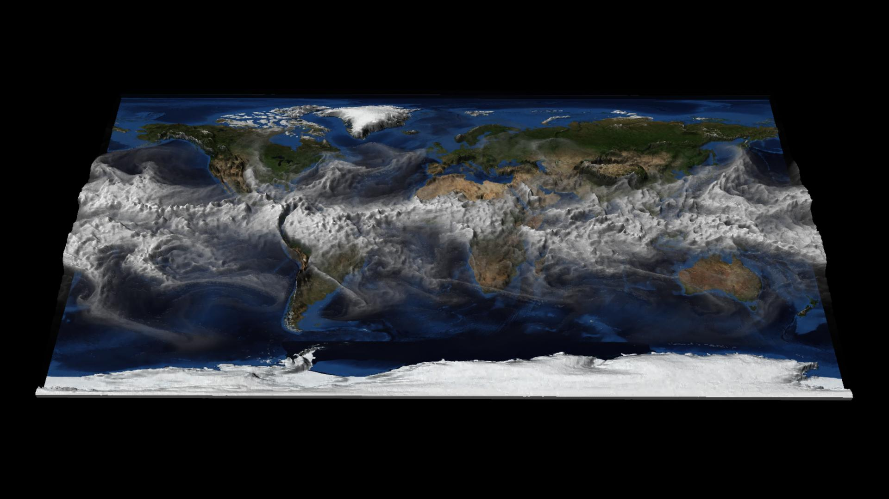

---
# Copy this file for a template that can then be placed in src/content/visualizations. The name of this file will be used as the URL for the post.

# String: full title of post.
title: "Planetary Water Vapor"

# String (optional): shortened version of title for display on home page in card.
shortenedTitle: "CESM Water Vapor"

# String (optional, by default "VAST Staff"). Author of this post.
author: ""

# String in the form "December 10, 2019".
datePosted: "September 11, 2013" 

# String representing a valid path to an image. Used in the card on the main page. Likely to be in the form "/src/assets/..." for images located in src/assets.
coverImage: "/src/assets/planetary-water-vapor.jpg"

# Array of strings. Each string (case insensitive) represents a filter from the front page. Tags that do not correspond to a current filter will be ignored for filtering.
topicTags: ["Atmosphere", "Climate"]
modelTags: ["CESM"]
softwareTags: ["Maya", "NCAR Command Language"]

# Case insensitive string describing the main media type ("Video", "Image", "App", etc). This is displayed in the post heading as a small tag above the title.
mediaType: "Video"

# The following headings and subheadings are provided examples - unused ones can be deleted. All Markdown content below will be rendered in the frontend.
---

<iframe width="560" height="315" src="https://www.youtube.com/embed/4794mgJLTbU?si=-CFgATxKckRB2OSq" title="YouTube video player" frameborder="0" allow="accelerometer; autoplay; clipboard-write; encrypted-media; gyroscope; picture-in-picture; web-share" referrerpolicy="strict-origin-when-cross-origin" allowfullscreen></iframe>

This visualization shows hourly time steps of CESM1 total column integrated water vapor (TMQ) for one year. The value of TMQ at each point determines the amount of 3D surface displacement. Higher values of TMQ have a larger displacement, helping to visually identify regions with the most significant temporal changes in water vapor.

___

#### More Media

___

#### About the Science

##### Science Credits

Justin Small (NCAR/NESL)

This simulation was made possible because of the large number of individuals both from within NCAR and the many outside collaborators who have contributed to the CESM1 development and runs.

##### Computational Resources

This research was enabled by NCAR’s Computational and Information Systems Laboratory (CISL) compute and storage resources, including Yellowstone, a 1.5-petaflops IBM iDataPlex supercomputer with 72,288 processor cores.

##### Model

The Community Earth System Model (CESM) is a fully-coupled, global climate model that provides state-of-the-art computer simulations of the Earth’s past, present, and future climate states.

CESM is sponsored by the National Science Foundation (NSF) and the U.S. Department of Energy (DOE). Administration of the CESM is maintained by the Climate and Global Dynamics Division (CGD) at the National Center for Atmospheric Research (NCAR).

This simulation has .25 degree resolution in the atmosphere and land, and 0.1 degree resolution in ocean and ice.

___

#### About the Visualization

##### Visualization and Post-production

Tim Scheitlin and Perry Domingo (NCAR/CISL)

##### Visualization Software

Visualization Software: The NCAR Command Language (Version 6.1.1) [Software]. (2013). Boulder, Colorado: UCAR/NCAR/CISL/VETS. http://dx.doi.org/10.5065/D6WD3XH5

___

#### More Information

##### Acknowledgements

NCAR-Wyoming Supercomputing Center (NWSC) University of Wyoming

