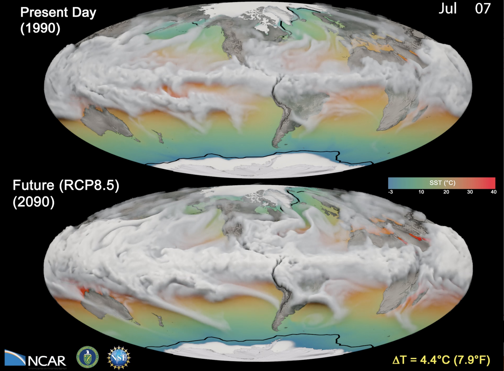

<iframe width="560" height="315" src="https://www.youtube.com/embed/APD6j5dc85M?si=PCXwSfP-fE4nr5Mm" title="YouTube video player" frameborder="0" allow="accelerometer; autoplay; clipboard-write; encrypted-media; gyroscope; picture-in-picture; web-share" referrerpolicy="strict-origin-when-cross-origin" allowfullscreen></iframe>

This visualization shows a CESM1 model comparison between a present day (1990) and a future (2090) simulation using a business-as-usual or high emissions scenario, called RCP8.5.  Clouds represent six-hourly time steps of total water vapor for one year. Technically speaking, this is the CESM1 model variable, TMQ, defined as the total precipitable water (vertically integrated) for each column in the atmosphere.  Bright, thick clouds visually identify regions with the highest values of precipitable water. Orange-red colors over the ocean indicate warm sea surface temperatures, while blue-green colors show cooler areas. Daily evolution of polar sea ice from CESM1 is shown for both the Arctic and Antarctic.  The solid black line in each hemisphere for both the future and present day panels indicates a decadal average of the maximum spatial extent of polar ice for the decade 1990-1999, accentuating the potential change in sea ice extent in the future relative to the present day.

___

#### More Media

___

#### About the Science

##### Science Credits

Warren Washington, Susan Bates, Nan Rosenbloom (NCAR/CGD)

##### Computational Modeling

This research is part of the Blue Waters sustained-petascale computing project, which is supported by the National Science Foundation (awards OCI-0725070 and ACI-1238993) and the state of Illinois. Blue Waters is a joint effort of the University of Illinois at Urbana-Champaign and its National Center for Supercomputing Applications. This work is also part of the “High Resolution Earth System Modeling Using Blue Waters Capabilities” PRAC allocation support by the National Science Foundation (award number ACI-1516624). Another award of computer time was provided by the Innovative and Novel Computational Impact on Theory and Experiment (INCITE) program.  This research used resources of the Argonne Leadership Computing Facility at Argonne National Laboratory, which is supported by the Office of Science of the U.S. Department of Energy under contract DE-AC02-06CH11357. Computing resources (doi:10.5065/D6RX99HX) were also provided by the Climate Simulation Laboratory at NCAR’s Computational and Information Systems Laboratory, sponsored by the National Science Foundation and other agencies.

##### Model

The data for this visualization was generated by the Community Earth System Model (CESM) with a high resolution atmosphere and land (0.25 degree) and a 1-degree ocean and sea ice.  The CESM is a fully-coupled, global climate model that provides state-of-the-art computer simulations of the Earth’s past, present, and future climate states. CESM is sponsored by the National Science Foundation (NSF) and the U.S. Department of Energy (DOE).

___

#### About the Visualization

##### Visualization and Post-production

Matt Rehme, Nihanth Cherukuru, Tim Scheitlin (NCAR/CISL)

##### Visualization Software

Many visualization tools were used to produce this visualization including Python, Blender and the NCAR Command Language.

The NCAR Command Language (Version 6.6.2) [Software]. (2019). 
Boulder, Colorado: UCAR/NCAR/CISL/TDD. http://dx.doi.org/10.5065/D6WD3XH5

___

#### More Information

##### Acknowledgements

This simulation was made possible because of the large number of individuals both from within NCAR and the many outside collaborators who have contributed to the CESM development and runs.

This research was supported by the Regional and Global Climate Modeling Program (RGCM) of the U.S. Department of Energy’s,  Office of Science (BER), Cooperative Agreement DE-FC02-97ER62402.

