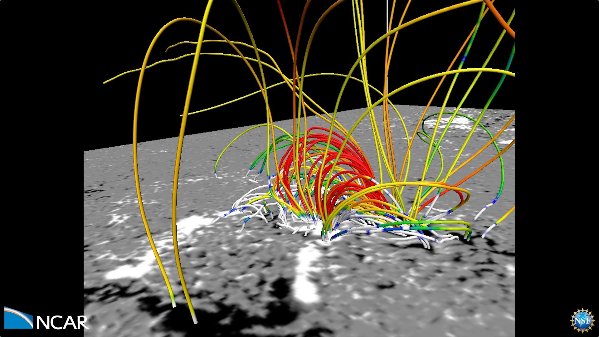

---
# Copy this file for a template that can then be placed in src/content/visualizations. The name of this file will be used as the URL for the post.

# String: full title of post.
title: "Radiative MHD Simulation of a Solar Active Region"

# String (optional): shortened version of title for display on home page in card.
shortenedTitle: ""

# String (optional, by default "VAST Staff"). Author of this post.
author: ""

# String in the form "December 10, 2019".
datePosted: "November 9, 2018" 

# String representing a valid path to an image. Used in the card on the main page. Likely to be in the form "/src/assets/..." for images located in src/assets.
coverImage: "/src/assets/radiative-mhd-simulation-of-a-solar-active-region.jpeg"

# The three following tag arrays are each an array of strings. Each string (case insensitive) represents a filter from the front page. Tags that do not correspond to a current filter will be ignored for filtering.

# options: atmosphere, climate, weather, oceans, sun-earth interactions, fire dynamics, solid earth, recent publications, experimental technologies
topicTags: ["sun-earth interactions"]

# options: CAM, CESM, CM1, CMAQ, CT-ROMS, DIABLO Large Eddy Simulation, HRRR, HWRF, MPAS, SIMA, WACCM, WRF
modelTags: [""]

# options: Blender, Maya, NCAR Command Language, ParaView, Visual Comparator, VAPOR
softwareTags: ["VAPOR"]

# Case insensitive string describing the main media type ("Video", "Image", "App", etc). This is displayed in the post heading as a small tag above the title.
mediaType: "Video"

# The following headings and subheadings are provided examples - unused ones can be deleted. All Markdown content below will be rendered in the frontend.
---

<iframe width="560" height="315" src="https://www.youtube.com/embed/lAmy6ynDLE8?si=lwck5MneCmYue7FU" title="YouTube video player" frameborder="0" allow="accelerometer; autoplay; clipboard-write; encrypted-media; gyroscope; picture-in-picture; web-share" referrerpolicy="strict-origin-when-cross-origin" allowfullscreen></iframe>

Radiative MHD Simulation of a Solar Active Region from Flux Emergence to Coronal Mass Ejections.

___

#### More Media

  

___

#### About the Science

##### Computational Modeling

Matthias Rempel (NCAR/HAO)

Feng Chen (NCAR/HAO, University of Colorado/LASP)

___

#### About the Visualization

##### Visualization and Post-production

John Clyne and Matt Rehme (NCAR/CISL)

___

#### More Information

##### Acknowledgements

This work was supported by the National Science Foundation and NCAR’s Advanced Scientific Discovery project.

NASA imagery courtesy of NASA/SDO and the AIA, EVE, and HMI science teams. http://sdo.gsfc.nasa.gov/