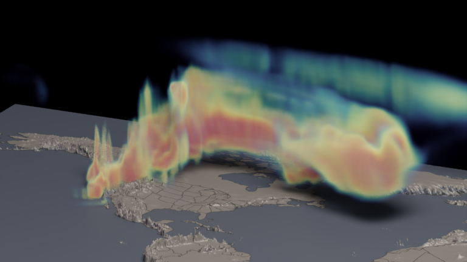

---
# Copy this file for a template that can then be placed in src/content/visualizations. The name of this file will be used as the URL for the post.

# String: full title of post.
title: "Simulations with MUSICA (Multi-Scale Infrastructure for Chemistry Modeling)"

# String (optional): shortened version of title for display on home page in card.
shortenedTitle: "MUSICA Carbon Monoxide Simulation"

# String (optional, by default "VAST Staff"). Author of this post.
author: ""

# String in the form "December 10, 2019".
datePosted: "September 12, 2022" 

# String representing a valid path to an image. Used in the card on the main page. Likely to be in the form "/src/assets/..." for images located in src/assets.
coverImage: "/src/assets/simulations-with-musica-multi-scale-infrastructure-for-chemistry-modeling.png"

# The three following tag arrays are each an array of strings. Each string (case insensitive) represents a filter from the front page. Tags that do not correspond to a current filter will be ignored for filtering.

# options: atmosphere, climate, weather, oceans, sun-earth interactions, fire dynamics, solid earth, recent publications, experimental technologies
topicTags: ["atmosphere", "weather"]

# options: CAM, CESM, CM1, CMAQ, CT-ROMS, DIABLO Large Eddy Simulation, HRRR, HWRF, MPAS, SIMA, WACCM, WRF
modelTags: [""]

# options: Blender, Maya, NCAR Command Language, ParaView, Visual Comparator, VAPOR
softwareTags: ["Blender"]

# Case insensitive string describing the main media type ("Video", "Image", "App", etc). This is displayed in the post heading as a small tag above the title.
mediaType: "Video"

# The following headings and subheadings are provided examples - unused ones can be deleted. All Markdown content below will be rendered in the frontend.
---

<iframe width="560" height="315" src="https://www.youtube.com/embed/ScjzOdykbUc?si=X4ttTqEbsma1GsYM" title="YouTube video player" frameborder="0" allow="accelerometer; autoplay; clipboard-write; encrypted-media; gyroscope; picture-in-picture; web-share" referrerpolicy="strict-origin-when-cross-origin" allowfullscreen></iframe>

These visualizations depict simulations created with MUSICA (Multi-Scale Infrastructure for Chemistry Modeling). The first simulation examines the Carbon Monoxide (CO) generated by a fire plume during the major fire events that occurred in the western United States in 2022. The second simulation depicts Ozone (O3) in the troposphere over a region of the western US in Summer 2020. 

___

#### More Media

 

___

#### About the Science

##### Science Credits

Wenfu Tang (NCAR/ACOM)

##### Computational Modeling

Wenfu Tang (NCAR/ACOM)

##### Model

MUSICA – Multi-Scale Infrastructure for Chemistry Modeling

___

#### About the Visualization

##### Visualization and Post-production

Matt Rehme (NCAR/CISL)

##### Visualization Software

Python, Blender, OpenVDB

___

#### More Information

##### Further Information

https://www2.acom.ucar.edu/sections/multi-scale-infrastructure-chemistry-modeling-musica
