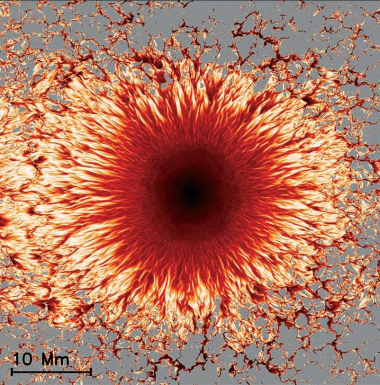

---
# Copy this file for a template that can then be placed in src/content/visualizations. The name of this file will be used as the URL for the post.

# String: full title of post.
title: "Sunspots"

# String (optional): shortened version of title for display on home page in card.
shortenedTitle: ""

# String (optional, by default "VAST Staff"). Author of this post.
author: ""

# String in the form "December 10, 2019".
datePosted: "September 1, 2012" 

# String representing a valid path to an image. Used in the card on the main page. Likely to be in the form "/src/assets/..." for images located in src/assets.
coverImage: "/src/assets/sunspots.jpg"

# The three following tag arrays are each an array of strings. Each string (case insensitive) represents a filter from the front page. Tags that do not correspond to a current filter will be ignored for filtering.

# options: atmosphere, climate, weather, oceans, sun-earth interactions, fire dynamics, solid earth, recent publications, experimental technologies
topicTags: ["sun-earth interactions"]

# options: CAM, CESM, CM1, CMAQ, CT-ROMS, DIABLO Large Eddy Simulation, HRRR, HWRF, MPAS, SIMA, WACCM, WRF
modelTags: [""]

# options: Blender, Maya, NCAR Command Language, ParaView, Visual Comparator, VAPOR
softwareTags: ["VAPOR"]

# Case insensitive string describing the main media type ("Video", "Image", "App", etc). This is displayed in the post heading as a small tag above the title.
mediaType: "Video"

# The following headings and subheadings are provided examples - unused ones can be deleted. All Markdown content below will be rendered in the frontend.
---

<iframe width="560" height="315" src="https://www.youtube.com/embed/B4HOjHm3UhU?si=9C3kS4UhDGQOfk8l" title="YouTube video player" frameborder="0" allow="accelerometer; autoplay; clipboard-write; encrypted-media; gyroscope; picture-in-picture; web-share" referrerpolicy="strict-origin-when-cross-origin" allowfullscreen></iframe>

Transition from umbra to penumbra shows changes in magnetic field. The interface between a sunspot’s umbra (dark center) and penumbra (lighter outer region) shows a complex structure with narrow, almost horizontal (lighter to white) filaments embedded in a background having a more vertical (darker to black) magnetic field. Farther out, extended patches of horizontal field dominate. For the first time, NCAR scientists and colleagues have modeled this complex structure in a comprehensive 3D computer simulation, giving scientists their first glimpse below the visible surface to understand the underlying physical processes.

___

#### More Media

 

___

#### About the Science

##### Science Credits

Matthias Rempel

___

#### About the Visualization

##### Visualization Software

VAPOR

___

#### More Information

##### Further Information

In a breakthrough that will help scientists unlock mysteries of the Sun and its impacts on Earth, an international team of scientists from NCAR and the Max Planck Institute for Solar System Research (MPS) has created the first-ever comprehensive computer model of sunspots ... [Read More](https://news.ucar.edu/864/spectacular-sunspots)

