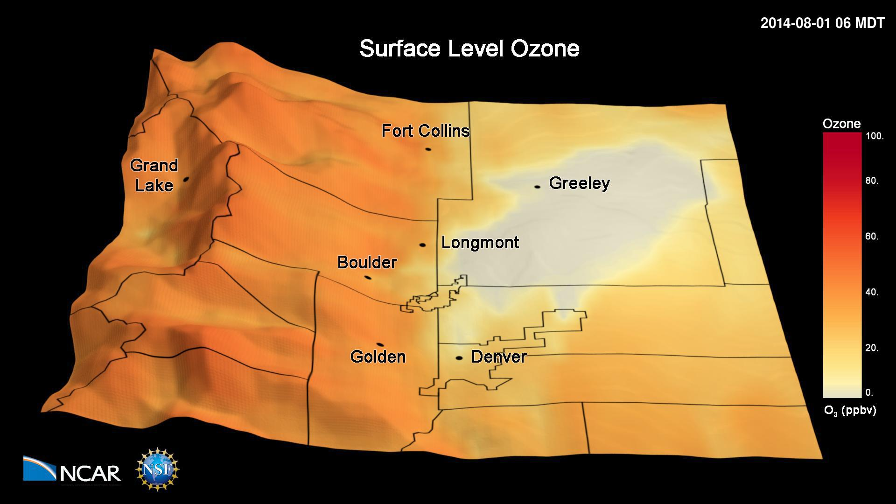

---
# Copy this file for a template that can then be placed in src/content/visualizations. The name of this file will be used as the URL for the post.

# String: full title of post.
title: "Surface Ozone Concentrations on the Colorado Front Range"

# String (optional): shortened version of title for display on home page in card.
shortenedTitle: "Front Range Surface Ozone Concentrations"

# String (optional, by default "VAST Staff"). Author of this post.
author: ""

# String in the form "December 10, 2019".
datePosted: "November 12, 2018" 

# String representing a valid path to an image. Used in the card on the main page. Likely to be in the form "/src/assets/..." for images located in src/assets.
coverImage: "/src/assets/surface-ozone-concentrations-on-the-colorado-front-range.jpg"

# The three following tag arrays are each an array of strings. Each string (case insensitive) represents a filter from the front page. Tags that do not correspond to a current filter will be ignored for filtering.

# options: atmosphere, climate, weather, oceans, sun-earth interactions, fire dynamics, solid earth, recent publications, experimental technologies
topicTags: ["atmosphere", "weather"]

# options: CAM, CESM, CM1, CMAQ, CT-ROMS, DIABLO Large Eddy Simulation, HRRR, HWRF, MPAS, SIMA, WACCM, WRF
modelTags: ["CMAQ", "WRF"]

# options: Blender, Maya, NCAR Command Language, ParaView, Visual Comparator, VAPOR
softwareTags: ["Maya", "NCAR Command Language"]

# Case insensitive string describing the main media type ("Video", "Image", "App", etc). This is displayed in the post heading as a small tag above the title.
mediaType: "Video"

# The following headings and subheadings are provided examples - unused ones can be deleted. All Markdown content below will be rendered in the frontend.
---

<iframe width="560" height="315" src="https://www.youtube.com/embed/jenQ_fPGLTk?si=qllkdn4regs15BSP" title="YouTube video player" frameborder="0" allow="accelerometer; autoplay; clipboard-write; encrypted-media; gyroscope; picture-in-picture; web-share" referrerpolicy="strict-origin-when-cross-origin" allowfullscreen></iframe>

This animation shows simulated hourly surface ozone concentrations during the 2014 FRAPPÉ campaign. The simulations have been performed with the Weather Research and Forecasting (WRF) Community Multiscale Air Quality (CMAQ) model.

 

The simulations have been conducted with a 4 km x 4 km grid horizontal resolution and show the frequent occurrence of high ozone pollution in the Colorado Front Range and the transport of this pollution into the nearby mountains during upslope events.

 

The model represents well observations made on the ground and from aircraft during the 2014 FRAPPÉ campaign (https://www2.acom.ucar.edu/frappe). 

___

#### More Media

  

___

#### About the Science

##### Data and Science Credits

Gabriele Pfister and Frank Flocke, NCAR/ACOM; NCAR/NSF and State of Colorado [FRAPPÉ](https://www2.acom.ucar.edu/frappe) and [NASA DISCOVER-AQ Colorado](https://www-air.larc.nasa.gov/missions/discover-aq/discover-aq.html) field experiments.

##### Computational Resources

This research used compute and storage resources from the NCAR Computational and Information Systems Laboratory including Yellowstone, a 1.5-petaflops, high-performance IBM iDataPlex cluster, and Glade, a centralized high-performance GPFS shared file system.

##### Model

The simulations have been performed with the Weather Research and Forecasting (WRF) Community Multiscale Air Quality (CMAQ) model.

___

#### About the Visualizations

##### Visualization and Post-production

Tim Scheitlin (NCAR/CISL)

##### Visualization Software

The NCAR Command Language (Version 6.4.0) [Software]. (2017). Boulder, Colorado: UCAR/NCAR/CISL/TDD. http://dx.doi.org/10.5065/D6WD3XH5

___

#### More Information

##### Acknowledgements

Sponsored by the National Science Foundation and the Colorado Department of Public Health and Environment.

##### Further Information

[NCAR/ACOM Report](https://www.colorado.gov/airquality/tech_doc_repository.aspx?action=open&file=FRAPPE-NCAR_Final_Report_July2017.pdf) prepared for the Colorado Department of Public Health and Environment.