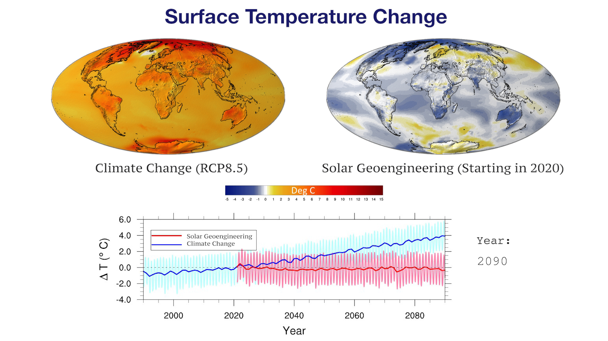
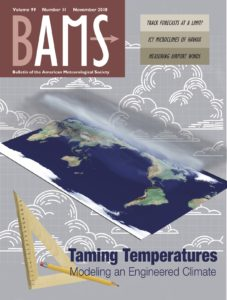

---
# Copy this file for a template that can then be placed in src/content/visualizations. The name of this file will be used as the URL for the post.

# String: full title of post.
title: "Surface Temperatures from Climate Change vs. Geoengineering"

# String (optional): shortened version of title for display on home page in card.
shortenedTitle: "Climate Change vs. Geoengineering"

# String (optional, by default "VAST Staff"). Author of this post.
author: ""

# String in the form "December 10, 2019".
datePosted: "November 9, 2017" 

# String representing a valid path to an image. Used in the card on the main page. Likely to be in the form "/src/assets/..." for images located in src/assets.
coverImage: "/src/assets/surface-temperatures-from-climate-change-vs-geoengineering.jpg"

# The three following tag arrays are each an array of strings. Each string (case insensitive) represents a filter from the front page. Tags that do not correspond to a current filter will be ignored for filtering.

# options: atmosphere, climate, weather, oceans, sun-earth interactions, fire dynamics, solid earth, recent publications, experimental technologies
topicTags: ["atmosphere", "climate", "recent publications"]

# options: CAM, CESM, CM1, CMAQ, CT-ROMS, DIABLO Large Eddy Simulation, HRRR, HWRF, MPAS, SIMA, WACCM, WRF
modelTags: ["CESM", "WACCM"]

# options: Blender, Maya, NCAR Command Language, ParaView, Visual Comparator, VAPOR
softwareTags: ["NCAR Command Language"]

# Case insensitive string describing the main media type ("Video", "Image", "App", etc). This is displayed in the post heading as a small tag above the title.
mediaType: "Video"

# The following headings and subheadings are provided examples - unused ones can be deleted. All Markdown content below will be rendered in the frontend.
---

<iframe width="560" height="315" src="https://www.youtube.com/embed/Rsb-8sqaiqw?si=PRnoMKmXHkkkjTzx" title="YouTube video player" frameborder="0" allow="accelerometer; autoplay; clipboard-write; encrypted-media; gyroscope; picture-in-picture; web-share" referrerpolicy="strict-origin-when-cross-origin" allowfullscreen></iframe>

This visualization describes temperature changes relative to years 2015-2024 from unabated climate change (RCP8.5) and stratospheric sulfate aerosol geoengineering (using feedback) simulated by a state-of-the-art coupled earth system model.  
 
Geoengineering, often using stratospheric sulfate aerosols, is discussed as a potential means of deliberately offsetting some of the effects of climate change, such as rising temperatures. Many previous simulations have looked at specific scenarios of geoengineering and analyzed the resulting climate effects. Here we turn the question around by choosing specific climate objectives and evaluating whether and how one can meet those objectives in the presence of uncertainty. In particular, we show the results of meeting three simultaneous surface temperature objectives (global mean, inter-hemispheric, and equator-to-pole gradient). The model uses feedback on the “observed” model state and adjusts the amount of sulfate aerosol injection in the stratosphere at each of four latitudes every year, depending on whether more or less is needed to keep the climate at 2020 conditions with increasing greenhouse gas emissions. While warming in the RCP8.5 simulation (a scenario with no climate policy) continues unabated, global patterns of warming are suppressed in the geoengineering (feedback) simulation.  
 
This simulation was produced with CESM1(WACCM), a version of the Community Earth System Model version 1 (CESM1) with the Whole Atmosphere Community Climate Model (WACCM) as its atmospheric component. This state-of-the-art atmosphere-ocean earth system model, developed by the National Center for Atmospheric Research (NCAR), contains significant advances in representations of chemistry, stratospheric dynamics, and aerosol microphysics. These representations, including an internally generated quasi-biennial oscillation, are crucial for capturing the important uncertainties and nonlinearities inherent in stratospheric sulfate aerosol geoengineering.

___

#### More Media

[BAMS November 2018 Cover](https://journals.ametsoc.org/view/journals/bams/99/11/bams.99.issue-11.xml)

___

#### About the Science

##### Science Credits

Dr. Jadwiga H. Richter (CGD/NCAR), Dr. Simone Tilmes (CGD/ACOM/NCAR), Dr. Michael Mills (ACOM/NCAR), Dr. Ben Kravitz (Pacific Northwest National Laboratory), and Dr. Douglas G. MacMartin (California Institute of Technology and Cornell University)

##### Computational Resources

This research was made possible with an NCAR Strategic Capabilities 10-million core-hour allocation on Yellowstone supercomputing platform, a 1.5 petaflops high-performance IBM iDataPlex cluster at the NCAR-Wyoming Supercomputer Center in Cheyenne, Wyoming. CISL/NCAR facilitated visualization, and storage resources.

##### Model

CESM1, WACCM

___

#### About the Visualization

##### Visualization and Post-production

Scientific Visualization Services Group (CISL/NCAR)

##### Visualization Software

The NCAR Command Language (Version 6.4.0) [Software]. (2017).
Boulder, Colorado: UCAR/NCAR/CISL/TDD. http://dx.doi.org/10.5065/D6WD3XH5

___

#### More Information

##### Further Information

Paper information: Kravitz, B., D. G. MacMartin, M. J. Mills, J. H. Richter, S. Tilmes, J.-F. Lamarque, J. J. Tribbia, and F. Vitt, 2017: “First simulations of designing stratospheric sulfate aerosol geoengineering to meet multiple simultaneous climate objectives”, J. Geophys. Res.
