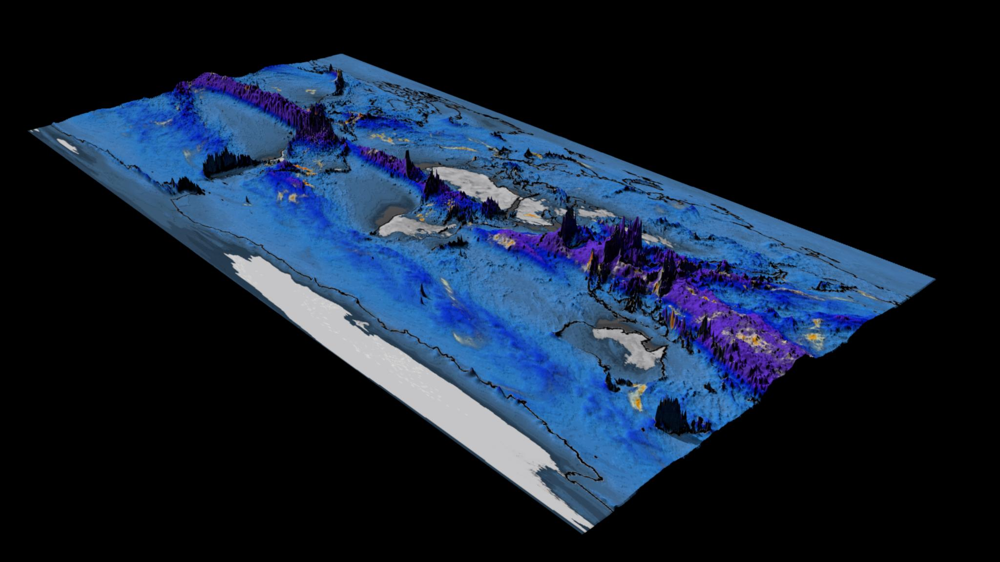

---
# Copy this file for a template that can then be placed in src/content/visualizations. The name of this file will be used as the URL for the post.

# String: full title of post.
title: "Total Accumulation of Global Precipitation"

# String (optional): shortened version of title for display on home page in card.
shortenedTitle: ""

# String (optional, by default "VAST Staff"). Author of this post.
author: ""

# String in the form "December 10, 2019".
datePosted: "November 9, 2018" 

# String representing a valid path to an image. Used in the card on the main page. Likely to be in the form "/src/assets/..." for images located in src/assets.
coverImage: "/src/assets/total-accumulation-of-global-precipitation.jpg"

# The three following tag arrays are each an array of strings. Each string (case insensitive) represents a filter from the front page. Tags that do not correspond to a current filter will be ignored for filtering.

# options: atmosphere, climate, weather, oceans, sun-earth interactions, fire dynamics, solid earth, recent publications, experimental technologies
topicTags: ["atmosphere", "weather"]

# options: CAM, CESM, CM1, CMAQ, CT-ROMS, DIABLO Large Eddy Simulation, HRRR, HWRF, MPAS, SIMA, WACCM, WRF
modelTags: [""]

# options: Blender, Maya, NCAR Command Language, ParaView, Visual Comparator, VAPOR
softwareTags: ["Maya", "NCAR Command Language"]

# Case insensitive string describing the main media type ("Video", "Image", "App", etc). This is displayed in the post heading as a small tag above the title.
mediaType: "Video"

# The following headings and subheadings are provided examples - unused ones can be deleted. All Markdown content below will be rendered in the frontend.
---

<iframe width="560" height="315" src="https://www.youtube.com/embed/xAZ1SuZ8Uwc?si=favZ562B2eitfp7W" title="YouTube video player" frameborder="0" allow="accelerometer; autoplay; clipboard-write; encrypted-media; gyroscope; picture-in-picture; web-share" referrerpolicy="strict-origin-when-cross-origin" allowfullscreen></iframe>

Project Metis: Seasonal Forecasts with Enhanced Ocean and Atmosphere Resolution

 

This visualization shows total accumulation of global precipitation (blue/purple) and the 6-hourly precipitation (yellow/red) between May 1 and Nov 1, 2015.

 

What to look for: Of particular interest are the cyclones that scrawl lines across the map, leaving a visible trail in the total precipitation field.

___

#### More Media

 

___

#### About the Science

##### Science Credits

Project Lead: Benjamin A Cash
COLA/GMU Team: J. Kinter III, E. Altshuler, M. Fennessy, V. Krishnamurthy, J. Manganello, D. Straus
ECMWF Team: R. Buizza, D. Decremer, F. Molteni, S. Saarinen

##### Computational Resources

This research was enabled by NCAR-CISL compute resources.  The simulation was run on Cheyenne, a 5.34-petaflops, SGI ICE XA Cluster featuring 145,152 Intel Xeon processor cores in 4,032 dual-socket nodes and 313 TB of total memory.

##### Data Source

The data for the visualization was generated as part of Project Metis, a continuation of the highly successful collaboration between the Center for Ocean-Land-Atmosphere Studies (COLA), located at George Mason University, and the European Centre for Medium-Range Weather Forecasts (ECMWF), in support of both centers’ ongoing efforts to understand and quantify predictability in the climate system from daily to interannual time scales.

 

The Metis project explores the impact of increasing both atmospheric and oceanic resolution on model fidelity and prediction skill in a coupled ocean (waves, currents and sea-ice), land and atmosphere ensemble framework.

___

#### About the Visualization

##### Visualization and Post-production

Tim Scheitlin (NCAR/CISL)

##### Visualization Software

The NCAR Command Language (Version 6.4.0) [Software]. (2017).
Boulder, Colorado: UCAR/NCAR/CISL/TDD. http://dx.doi.org/10.5065/D6WD3XH5

___

#### More Information

##### Acknowledgements

Map Imagery courtesy of NASA Visible Earth.

 

This research was enabled by the National Center for Atmospheric Research (NCAR) CISL compute resources. The simulation was run on Cheyenne, a 5.34 petaflops, SGI ICE XA Cluster featuring 145,152 latest-generation Intel Xeon processor cores in 4,032 dual-socket nodes (36 cores/node) and 313 TB of total memory.