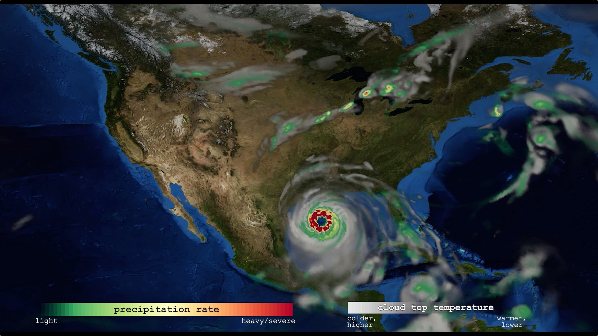

---
# Copy this file for a template that can then be placed in src/content/visualizations. The name of this file will be used as the URL for the post.

# String: full title of post.
title: "Variable Resolution Regional Climate Simulations with CESM"

# String (optional): shortened version of title for display on home page in card.
shortenedTitle: "Precipitation Rate"

# String (optional, by default "VAST Staff"). Author of this post.
author: ""

# String in the form "December 10, 2019".
datePosted: "November 9, 2018" 

# String representing a valid path to an image. Used in the card on the main page. Likely to be in the form "/src/assets/..." for images located in src/assets.
coverImage: "/src/assets/variable-resolution-regional-climate-simulations-with-cesm.jpeg"

# The three following tag arrays are each an array of strings. Each string (case insensitive) represents a filter from the front page. Tags that do not correspond to a current filter will be ignored for filtering.

# options: atmosphere, climate, weather, oceans, sun-earth interactions, fire dynamics, solid earth, recent publications, experimental technologies
topicTags: ["Atmosphere"]

# options: CAM, CESM, CM1, CMAQ, CT-ROMS, DIABLO Large Eddy Simulation, HRRR, HWRF, MPAS, SIMA, WACCM, WRF
modelTags: ["CESM"]

# options: Blender, Maya, NCAR Command Language, ParaView, Visual Comparator, VAPOR
softwareTags: [""]

# Case insensitive string describing the main media type ("Video", "Image", "App", etc). This is displayed in the post heading as a small tag above the title.
mediaType: "Video"

# The following headings and subheadings are provided examples - unused ones can be deleted. All Markdown content below will be rendered in the frontend.
---

<iframe width="560" height="315" src="https://www.youtube.com/embed/PCl9dUHulK0?si=2RiEKMrzx70z9Hnu" title="YouTube video player" frameborder="0" allow="accelerometer; autoplay; clipboard-write; encrypted-media; gyroscope; picture-in-picture; web-share" referrerpolicy="strict-origin-when-cross-origin" allowfullscreen></iframe>

This visualization shows the output from a Variable Resolution Regional Climate Simulation with CESM (Community Earth System Model).

___

#### More Media

___

#### About the Science

##### Computational Modeling

Colin Zarzycki, Andrew Gettelman, Peter Lauritzen and Patrick Callaghan (NCAR/CGD)

##### Model

Variable Resolution Regional Climate Simulations with CESM (Community Earth System Model)

___

#### About the Visualization

##### Visualization and Post-production

John Clyne and Matt Rehme (NCAR/CISL)

___

#### More Information

##### Acknowledgements

This work was supported by the National Science Foundation and NCAR’s Advanced Scientific Discovery project.
The National Center for Atmospheric Research is sponsored by the National Science Foundation.
© 2017 UCAR Any opinions, findings and conclusions, or recommendations expressed in this material are those of the author(s) and do not necessarily reflect the views of the National Science Foundation.

