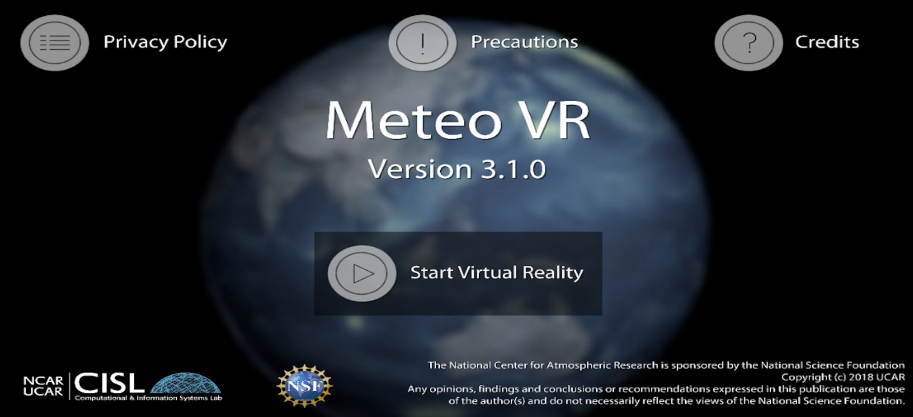
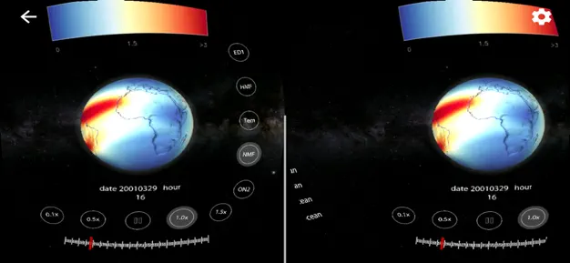
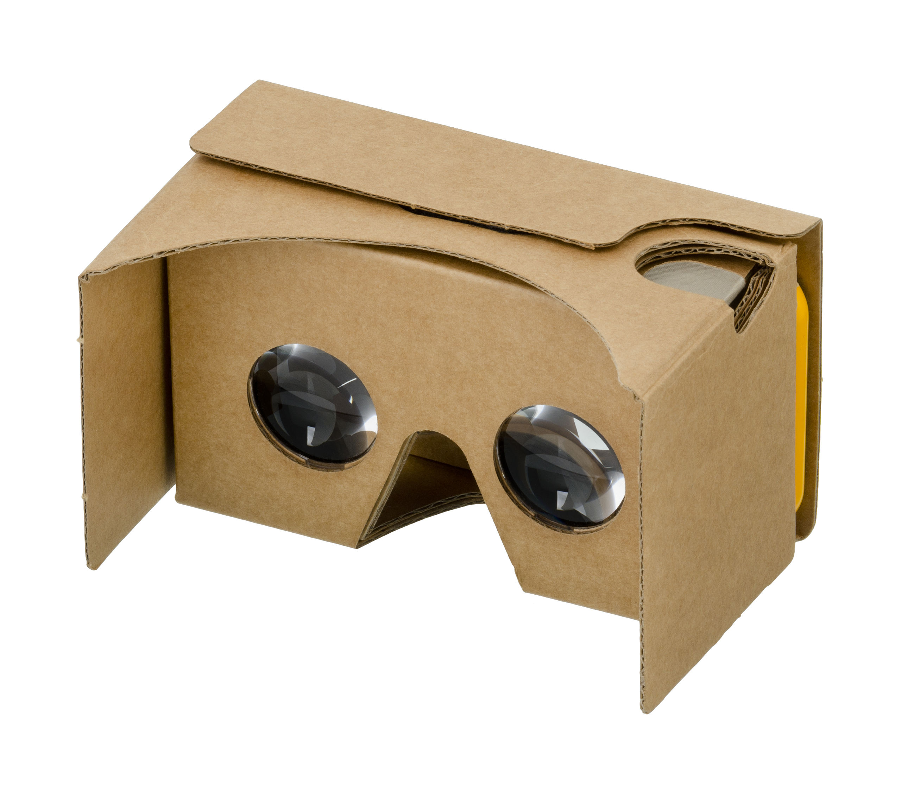
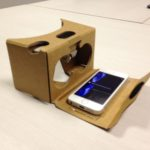

---
# Copy this file for a template that can then be placed in src/content/visualizations. The name of this file will be used as the URL for the post.

# String: full title of post.
title: "Virtual Reality"

# String (optional): shortened version of title for display on home page in card.
shortenedTitle: ""

# String (optional, by default "VAST Staff"). Author of this post.
author: ""

# String in the form "December 10, 2019".
datePosted: "January 4, 2019" 

# String representing a valid path to an image. Used in the card on the main page. Likely to be in the form "/src/assets/..." for images located in src/assets.
coverImage: "/src/assets/virtual-reality.png"

# The three following tag arrays are each an array of strings. Each string (case insensitive) represents a filter from the front page. Tags that do not correspond to a current filter will be ignored for filtering.

# options: atmosphere, climate, weather, oceans, sun-earth interactions, fire dynamics, solid earth, recent publications, experimental technologies
topicTags: ["experimental technologies"]

# options: CAM, CESM, CM1, CMAQ, CT-ROMS, DIABLO Large Eddy Simulation, HRRR, HWRF, MPAS, SIMA, WACCM, WRF
modelTags: [""]

# options: Blender, Maya, NCAR Command Language, ParaView, Visual Comparator, VAPOR
softwareTags: [""]

# Case insensitive string describing the main media type ("Video", "Image", "App", etc). This is displayed in the post heading as a small tag above the title.
mediaType: "App"

# The following headings and subheadings are provided examples - unused ones can be deleted. All Markdown content below will be rendered in the frontend.
---
 

NSF NCAR has implemented Virtual and [Augmented Reality](/cisl-visualization-gallery/visualizations/augmented-reality) (AR/VR) technologies to help make NCAR science more engaging and accessible to a wider audience. We have developed mobile apps and tools that enable users to explore geoscience data from their mobile device, such as an iPhone, iPad, or an Android device.   The apps are free and available for download at the Apple Store and for Android devices at Google Play.

___

#### Meteo VR

Meteo VR is a **Virtual Reality** (VR) application that works with inexpensive devices like Google Cardboard to turn your mobile phone into a 3D VR platform for exploring geoscience data.  Google Cardboard is available for purchase from many online retailers.  Search “Google Cardboard.”  Note: make sure the cardboard device has an “interactive click button”.   

 

___

#### More Information and How to Download

<a class="launch-button" href="http://meteoappsweb.s3-website-us-west-1.amazonaws.com/" alt="More information about Meteo AR and VR">Click here</a>

___

#### More Media

##### Meteo VR

##### Google Cardboard

##### VR with Google Cardboard
