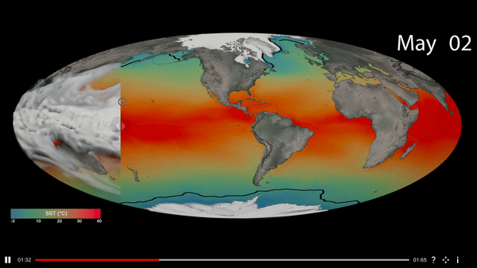

---
# Copy this file for a template that can then be placed in src/content/visualizations. The name of this file will be used as the URL for the post.

# String: full title of post.
title: "Visual Comparator"

# String (optional): shortened version of title for display on home page in card.
shortenedTitle: ""

# String (optional, by default "VAST Staff"). Author of this post.
author: ""

# String in the form "December 10, 2019".
datePosted: "August 22, 2019" 

# String representing a valid path to an image. Used in the card on the main page. Likely to be in the form "/src/assets/..." for images located in src/assets.
coverImage: "/src/assets/visual-comparator.png"

# The three following tag arrays are each an array of strings. Each string (case insensitive) represents a filter from the front page. Tags that do not correspond to a current filter will be ignored for filtering.

# options: atmosphere, climate, weather, oceans, sun-earth interactions, fire dynamics, solid earth, recent publications, experimental technologies
topicTags: ["experimental technologies"]

# options: CAM, CESM, CM1, CMAQ, CT-ROMS, DIABLO Large Eddy Simulation, HRRR, HWRF, MPAS, SIMA, WACCM, WRF
modelTags: [""]

# options: Blender, Maya, NCAR Command Language, ParaView, Visual Comparator, VAPOR
softwareTags: ["Visual Comparator"]

# Case insensitive string describing the main media type ("Video", "Image", "App", etc). This is displayed in the post heading as a small tag above the title.
mediaType: "App"

# The following headings and subheadings are provided examples - unused ones can be deleted. All Markdown content below will be rendered in the frontend.
---

Visualizations enable us to detect patterns and trends in complex data sets, that might not be obvious by looking at the raw data alone. The visual exploration process often requires comparisons between multiple visualizations, either from the same dataset (E.g. different variables) or a different one, to identify relationships and compare patterns. The existing tools that facilitate visual comparisons do this by three means: Juxtaposition (placing visuals side-by-side), Superposition (overlaying visuals) and Explicit Encoding (visualizing a derived quantity corresponding to the relationship being studied). While superposition is ideal for geospatial datasets, where spatialization is a key component of the data, the spatio-temporal nature of atmospheric science data presents a challenge with comparative visualizations. 

 

The Visual Comparator presented here is a cross-platform application (Desktop, Kiosk and Web) that could be used to superimpose and compare up to three synchronized, animated visualizations and enable the viewer to transit between the visualizations using a slider. This form of visualization has the advantage of drawing the viewer’s attention to changes between the datasets, enabling comparisons of scale and reducing the clutter caused by having multiple variables in one visual.

<a class="launch-button" href="https://aws-unity-test-bucket.s3.amazonaws.com/DemoSetv2/index.html" alt="Link to site with visual comparator examples." target="_blank">See examples here.</a>