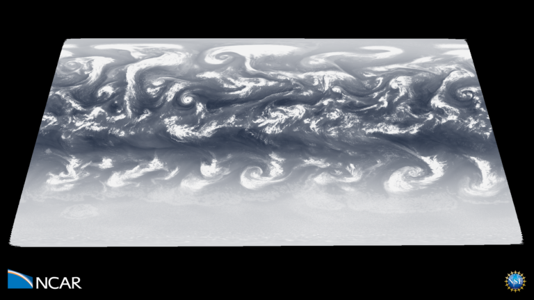

---
# Copy this file for a template that can then be placed in src/content/visualizations. The name of this file will be used as the URL for the post.

# String: full title of post.
title: "Weather Systems in a World without Land or Seasons"

# String (optional): shortened version of title for display on home page in card.
shortenedTitle: ""

# String (optional, by default "VAST Staff"). Author of this post.
author: ""

# String in the form "December 10, 2019".
datePosted: "February 23, 2021" 

# String representing a valid path to an image. Used in the card on the main page. Likely to be in the form "/src/assets/..." for images located in src/assets.
coverImage: "/src/assets/weather-systems-in-a-world-without-land-or-seasons.png"

# The three following tag arrays are each an array of strings. Each string (case insensitive) represents a filter from the front page. Tags that do not correspond to a current filter will be ignored for filtering.

# options: atmosphere, climate, weather, oceans, sun-earth interactions, fire dynamics, solid earth, recent publications, experimental technologies
topicTags: ["atmosphere", "oceans"]

# options: CAM, CESM, CM1, CMAQ, CT-ROMS, DIABLO Large Eddy Simulation, HRRR, HWRF, MPAS, SIMA, WACCM, WRF
modelTags: ["MPAS"]

# options: Blender, Maya, NCAR Command Language, ParaView, Visual Comparator, VAPOR
softwareTags: ["Vapor"]

# Case insensitive string describing the main media type ("Video", "Image", "App", etc). This is displayed in the post heading as a small tag above the title.
mediaType: "Video"

# The following headings and subheadings are provided examples - unused ones can be deleted. All Markdown content below will be rendered in the frontend.
---

<iframe width="560" height="315" src="https://www.youtube.com/embed/DarH-1H6vgM?si=zlH82jO5G_hndAZu" title="YouTube video player" frameborder="0" allow="accelerometer; autoplay; clipboard-write; encrypted-media; gyroscope; picture-in-picture; web-share" referrerpolicy="strict-origin-when-cross-origin" allowfullscreen></iframe>

Aquaplanet simulations—as their name suggests—are idealized representations of Earth where the planet is covered entirely by water. The absence of continents, while unrealistic, provides a clean laboratory where weather systems can develop, evolve, and dissipate as they would do over Earth’s oceans. This kind of simulation is, therefore, useful for learning about the fundamental processes that govern the evolution of weather systems.

 

Here, the Model for Prediction Across Scales – Atmosphere (MPAS-A) was used to create an aquaplanet simulation with 3-km cell spacing (considered “convection-permitting” resolution) in the tropics transitioning to 15-km cell spacing elsewhere. This simulation develops a climate and weather systems that are very similar to those observed on Earth: a line of intense thunderstorms in the tropics, occasional tropical cyclones that migrate westward and poleward, an area of relatively quiet and dry weather in the subtropics, and a region of very active cyclones in the middle and polar latitudes. NCAR scientists are using this simulation to uncover the processes that favor the formation of powerful tropical cyclones—a very active area of research where our knowledge is very limited.

 

Outgoing longwave radiation is used here as a proxy for clouds. The MPAS-A aquaplanet simulation starts from a quiescent state without any weather systems. As the simulation progresses, the combination of a sea-surface temperature condition and model physics lead to the development of weather systems everywhere. By one month, the weather patterns resemble those of real Earth. Of particular interest, tropical cyclones form in the deep tropics, move westward and poleward, and dissipate as they leave the warm tropical oceans.

___

#### More Media

 

___

#### About the Science

##### Computational Modeling

Rosimar Rios-Berrios (NCAR/MMM)

##### Computational Resources

NCAR Strategic Capability project NASP0010

 

NCAR/MMM Director’s Reserve project NMMM0042

##### Model

[Model for Prediction Across Scales-Atmosphere (MPAS-A)](https://mpas-dev.github.io/).

 

A Multi-scale Nonhydrostatic Atmospheric Model Using Centroidal Voronoi Tesselations and C-Grid Staggering. William C. Skamarock, Joseph B. Klemp, Michael G. Duda, Laura Fowler, Sang-Hun Park, and Todd D. Ringler. 2012 Monthly Weather Review, 240, 3090-3105, doi:10.1175/MWR-D-11-00215.1

##### Data Source

Post-processed data from this and other MPAS-A aquaplanet simulations are available at https://doi.org/10.5065/cam1-v353

 

Rios-Berrios, Rosimar, Medeiros, Brian, Bryan, George. (2020). Aquaplanet simulations using the Model for Prediction Across Scales (MPAS) version 6.2. Version 1.0. UCAR/NCAR – DASH Repository. https://doi.org/10.5065/cam1-v353. Accessed 22 Feb 2021.

___

#### About the Visualization

##### Visualization and Post-production

Matt Rehme (NCAR/CISL)

##### Visualization Software

Imagery produced by VAPOR (www.vapor.ucar.edu), a product of the Computational Information Systems Laboratory at the NSF National Center for Atmospheric Research.

___

#### More Information

##### Further Information

Rios‐Berrios, R., Medeiros, B., & Bryan, G. H. (2020). Mean climate and tropical rainfall variability in aquaplanet simulations using the Model for Prediction Across Scales‐Atmosphere. Journal of Advances in Modeling Earth Systems, 12, e2020MS002102. https://doi.org/10.1029/2020MS002102
