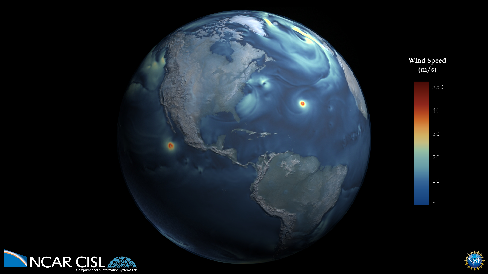

---
# Copy this file for a template that can then be placed in src/content/visualizations. The name of this file will be used as the URL for the post.

# String: full title of post.
title: "Wind Speed"

# String (optional): shortened version of title for display on home page in card.
shortenedTitle: ""

# String (optional, by default "VAST Staff"). Author of this post.
author: ""

# String in the form "December 10, 2019".
datePosted: "October 11, 2017" 

# String representing a valid path to an image. Used in the card on the main page. Likely to be in the form "/src/assets/..." for images located in src/assets.
coverImage: "/src/assets/wind-speed.png"

# The three following tag arrays are each an array of strings. Each string (case insensitive) represents a filter from the front page. Tags that do not correspond to a current filter will be ignored for filtering.

# options: atmosphere, climate, weather, oceans, sun-earth interactions, fire dynamics, solid earth, recent publications, experimental technologies
topicTags: ["atmosphere", "weather"]

# options: CAM, CESM, CM1, CMAQ, CT-ROMS, DIABLO Large Eddy Simulation, HRRR, HWRF, MPAS, SIMA, WACCM, WRF
modelTags: ["CESM"]

# options: Blender, Maya, NCAR Command Language, ParaView, Visual Comparator, VAPOR
softwareTags: [""]

# Case insensitive string describing the main media type ("Video", "Image", "App", etc). This is displayed in the post heading as a small tag above the title.
mediaType: "Video"

# The following headings and subheadings are provided examples - unused ones can be deleted. All Markdown content below will be rendered in the frontend.
---

<iframe width="560" height="315" src="https://www.youtube.com/embed/tlQHki79K84?si=XLCPXrKUaOuidckb" title="YouTube video player" frameborder="0" allow="accelerometer; autoplay; clipboard-write; encrypted-media; gyroscope; picture-in-picture; web-share" referrerpolicy="strict-origin-when-cross-origin" allowfullscreen></iframe>

This visualization shows the magnitude of the wind speed over the course of one year from atmosphere-only simulations of the high resolution (horizontal 1/4 degree) Community Earth System Model simulating the present day climate.

___

#### More Media

 

___

#### About the Science

##### Science Credits

Susan Bates and Nan Rosenbloom

##### Computational Resources

This research used resources of the Argonne Leadership Computing Facility at Argonne National Laboratory, which is supported by the Office of Science of the U.S. Department of Energy under contract DE-AC02-06CH11357.

 

Computing resources (ark:/85065/d7wd3xhc) were provided by the Climate Simulation Laboratory at NCAR’s Computational and Information Systems Laboratory, sponsored by the National Science Foundation and other agencies.

___

#### About the Visualization

##### Visualization and Post-production

Matt Rehme (NCAR)

___

#### More Information

##### Acknowledgements

An award of computer time was provided by the Innovative and Novel Computational Impact on Theory and Experiment (INCITE) program. This research was supported by the Regional and Global Climate Modeling Program (RGCM) of the U.S. Department of Energy’s, Office of Science (BER), Cooperative Agreement DE-FC02-97ER62402.
