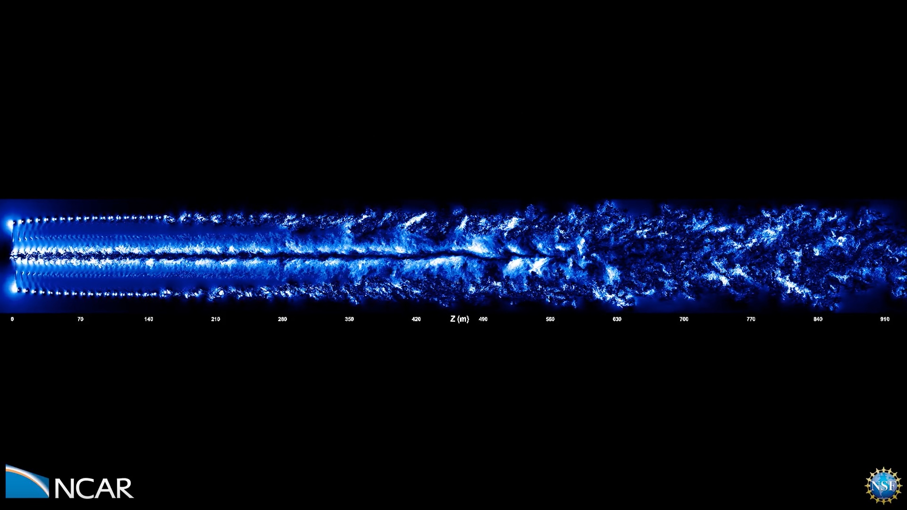

---
# Copy this file for a template that can then be placed in src/content/visualizations. The name of this file will be used as the URL for the post.

# String: full title of post.
title: "Wind Turbine Performance"

# String (optional): shortened version of title for display on home page in card.
shortenedTitle: ""

# String (optional, by default "VAST Staff"). Author of this post.
author: ""

# String in the form "December 10, 2019".
datePosted: "September 7, 2017" 

# String representing a valid path to an image. Used in the card on the main page. Likely to be in the form "/src/assets/..." for images located in src/assets.
coverImage: "/src/assets/wind-turbine-performance.jpeg"

# The three following tag arrays are each an array of strings. Each string (case insensitive) represents a filter from the front page. Tags that do not correspond to a current filter will be ignored for filtering.

# options: atmosphere, climate, weather, oceans, sun-earth interactions, fire dynamics, solid earth, recent publications, experimental technologies
topicTags: ["atmosphere", "weather"]

# options: CAM, CESM, CM1, CMAQ, CT-ROMS, DIABLO Large Eddy Simulation, HRRR, HWRF, MPAS, SIMA, WACCM, WRF
modelTags: [""]

# options: Blender, Maya, NCAR Command Language, ParaView, Visual Comparator, VAPOR
softwareTags: [""]

# Case insensitive string describing the main media type ("Video", "Image", "App", etc). This is displayed in the post heading as a small tag above the title.
mediaType: "Video"

# The following headings and subheadings are provided examples - unused ones can be deleted. All Markdown content below will be rendered in the frontend.
---

<iframe width="560" height="315" src="https://www.youtube.com/embed/NHNL5JRQnHQ?si=XwlvJT_LrmPV2mrv" title="YouTube video player" frameborder="0" allow="accelerometer; autoplay; clipboard-write; encrypted-media; gyroscope; picture-in-picture; web-share" referrerpolicy="strict-origin-when-cross-origin" allowfullscreen></iframe>

Wind Turbine Simulation And Its Animation:

Computational Study of Wind Turbine Performance And Loading Response to Turbulent Atmospheric Inflow Conditions

___

#### More Media

  

___

#### About the Science

##### Developers

University of Wyoming:

Dimitri Mavriplis

Michael Stoellinger

Michael Brazell

Andrew Kirby

Zhi Yang

##### Computational Resources

NCAR-Wyoming Supercomputer Center – Accelerated Science Discovery

Wyoming-NCAR Alliance

University of Wyoming ARCC

NSF Blue Waters sustained-petascale computing project

2016 Blue Waters Graduate Fellowship

___

#### About the Visualization

##### Visualization and Meshing Support:

Intelligent Light: Earl Duque

Brad Whitlock

##### University of Wyoming 3D Visualization Center:

Emma-Jane Alexander

Kyle Summerfield

Nikhil Shetty

University of Wyoming:
Behzad R. Ahrabi

##### Post-production

Samuel Li and Matt Rehme (NCAR/CISL)

___

#### More Information

##### Parallel Geometric Algorithms, LLC.:

Jay Sitaraman

##### Funding

Office of Naval Research Grants N00014-14-1-0045, N00014-16-1-2737

Department of Energy, Office of Science, Basic Energy Sciences Award DE-SC0012671

National Science Foundation

Blue Waters Graduate Fellowship

National Science Foundation (awards OCI-0725070 and ACI-1238993)

 

This work was supported by the National Science Foundation and NCAR’s Advanced Scientific Discovery project.
