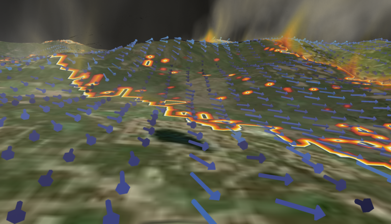

---
# Copy this file for a template that can then be placed in src/content/visualizations. The name of this file will be used as the URL for the post.

# String: full title of post.
title: "WRF-Fire: East Troublesome Wildfire from Granby, CO"

# String (optional): shortened version of title for display on home page in card.
shortenedTitle: "East Troublesome Wildfire"

# String (optional, by default "VAST Staff"). Author of this post.
author: ""

# String in the form "December 10, 2019".
datePosted: "September 16, 2022" 

# String representing a valid path to an image. Used in the card on the main page. Likely to be in the form "/src/assets/..." for images located in src/assets.
coverImage: "/src/assets/wrf-fire-east-troublesome-wildfire-from-granby-co-3.png"

# The three following tag arrays are each an array of strings. Each string (case insensitive) represents a filter from the front page. Tags that do not correspond to a current filter will be ignored for filtering.

# options: atmosphere, climate, weather, oceans, sun-earth interactions, fire dynamics, solid earth, recent publications, experimental technologies
topicTags: ["fire dynamics"]

# options: CAM, CESM, CM1, CMAQ, CT-ROMS, DIABLO Large Eddy Simulation, HRRR, HWRF, MPAS, SIMA, WACCM, WRF
modelTags: [""]

# options: Blender, Maya, NCAR Command Language, ParaView, Visual Comparator, VAPOR
softwareTags: ["vapor"]

# Case insensitive string describing the main media type ("Video", "Image", "App", etc). This is displayed in the post heading as a small tag above the title.
mediaType: "Video"

# The following headings and subheadings are provided examples - unused ones can be deleted. All Markdown content below will be rendered in the frontend.
---

<iframe width="560" height="315" src="https://www.youtube.com/embed/Se3DE20vMQM?si=nc4i-mSV1gNZOpTz" title="YouTube video player" frameborder="0" allow="accelerometer; autoplay; clipboard-write; encrypted-media; gyroscope; picture-in-picture; web-share" referrerpolicy="strict-origin-when-cross-origin" allowfullscreen></iframe>

<iframe width="560" height="315" src="https://www.youtube.com/embed/2TlNkyb5FKc?si=92azEixJygk2DH_U" title="YouTube video player" frameborder="0" allow="accelerometer; autoplay; clipboard-write; encrypted-media; gyroscope; picture-in-picture; web-share" referrerpolicy="strict-origin-when-cross-origin" allowfullscreen></iframe>

<iframe width="560" height="315" src="https://www.youtube.com/embed/ndM8EgY2JfI?si=YNMXrKYDVVifE_7W" title="YouTube video player" frameborder="0" allow="accelerometer; autoplay; clipboard-write; encrypted-media; gyroscope; picture-in-picture; web-share" referrerpolicy="strict-origin-when-cross-origin" allowfullscreen></iframe>

On October 14, 2020, the East Troublesome Wildfire ignited. It burnt 193,812 acres over the course of 48 days. Between October 20-23 the wildfire rapidly intensified, exploding from 18,550 acres to 187,964 acres in size.* These visualizations show a Weather Research & Forecasting (WRF) simulation of the East Troublesome Wildfire from the perspective of Granby, Colorado. It uses a physics module (WRF-Fire) that incorporates an AI driven model for combustable plant matter known as Beetle Kill. 

*https://inciweb.nwcg.gov/incident/7242/

___

#### More Media

##### Visualization of East Troublesome Fire from Granby in VAPOR

##### Visualization of East Troublesome Fire from Estes Park in VAPOR

##### Visualization of East Troublesome Fire from Grand Lake in VAPOR

___

#### About the Science

##### Science Credits

Timothy W. Juliano (NCAR/RAL), Amy DeCastro (NCAR/RAL), Branko Kosovic (NCAR/RAL), Catrin Edgeley (Northern Arizona School of Forestry)

##### Computational Modeling

Timothy W. Juliano (NCAR/RAL), Amy DeCastro (NCAR/RAL), Branko Kosovic (NCAR/RAL), Catrin Edgeley (Northern Arizona School of Forestry)

##### Computational Resources

This research was enabled by NCAR’s Computational and Information Systems Laboratory (CISL) compute and storage resources. Cheyenne, a 5.34-petaflops, high-performance computer built for NCAR by SGI, featuring 145,152 Intel Xeon processor cores in 4,032 dual-socket nodes (36 cores/node) and 313 TB of total memory.

##### Model

WRF-Fire

___

#### About the Visualization

##### Visualization and Post-production

Scott Pearse

##### Visualization Software

VAPOR

___

#### More Information

##### Further Information

https://ral.ucar.edu/model/wrf-fire-wildland-fire-modeling

https://www.vapor.ucar.edu/